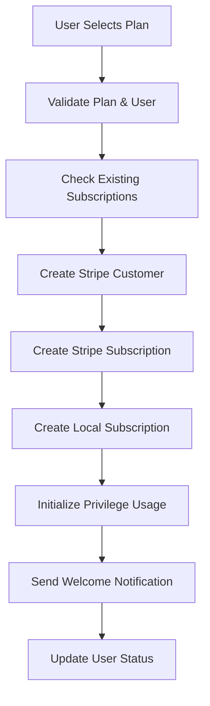
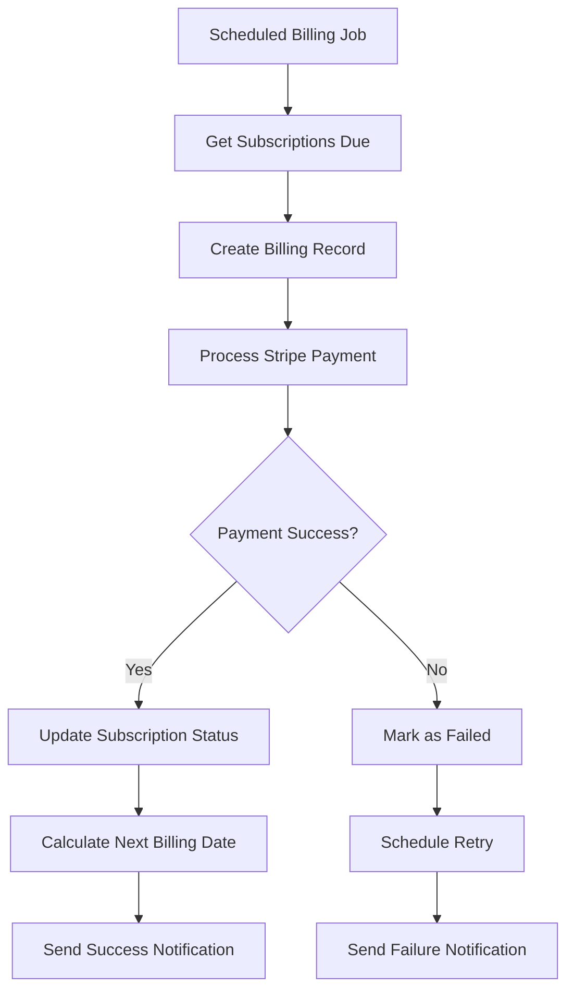
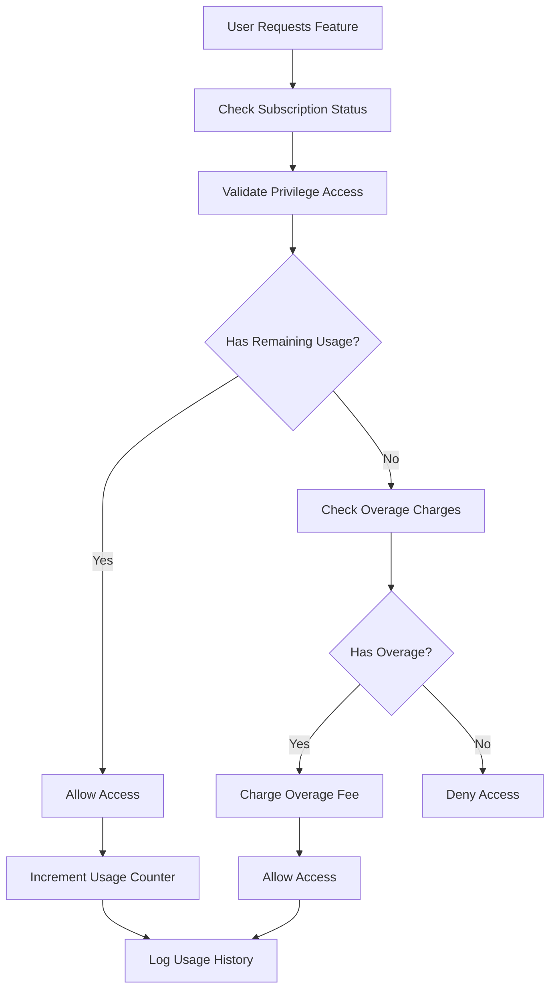

# Complete Subscription Management Workflow Analysis

## Overview
This document provides a comprehensive analysis of the SmartTeleHealth backend subscription management system, including all entities, relationships, services, repositories, controllers, and business logic workflows.

## 1. Core Architecture

### 1.1 Entity Relationships

#### Primary Entities
- **User**: Core user entity extending ASP.NET Identity
- **Subscription**: Individual user subscription to a plan
- **SubscriptionPlan**: Template defining available plans
- **BillingRecord**: Payment and billing transactions
- **Privilege**: System capabilities/features
- **SubscriptionPlanPrivilege**: Junction between plans and privileges

#### Master Reference Entities
- **MasterBillingCycle**: Billing frequency (monthly, yearly, etc.)
- **MasterCurrency**: Supported currencies (USD, EUR, etc.)
- **MasterPrivilegeType**: Categories of privileges
- **Category**: Plan categorization

#### Supporting Entities
- **UserSubscriptionPrivilegeUsage**: Tracks privilege consumption
- **PrivilegeUsageHistory**: Detailed usage tracking
- **BillingAdjustment**: Billing modifications and corrections

### 1.2 Entity Relationship Diagram

```
User (1) -----> (N) Subscription (N) -----> (1) SubscriptionPlan
    |                      |                        |
    |                      |                        |
    v                      v                        v
BillingRecord         PrivilegeUsage         SubscriptionPlanPrivilege
    |                      |                        |
    |                      |                        |
    v                      v                        v
StripeIntegration     UsageHistory              Privilege
```

## 2. Subscription Lifecycle Management

### 2.1 Subscription Creation Workflow

#### Step 1: Plan Selection
```csharp
// User selects a subscription plan
var plan = await _subscriptionPlanRepository.GetByIdAsync(planId);
```

#### Step 2: Validation
- Check if plan is active and available
- Verify user doesn't have conflicting active subscription
- Validate payment method exists

#### Step 3: Stripe Integration
```csharp
// Create Stripe customer if needed
var customerId = await _stripeService.CreateCustomerAsync(email, name, token);

// Create Stripe subscription
var stripeSubscriptionId = await _stripeService.CreateSubscriptionAsync(
    customerId, priceId, paymentMethodId, token);
```

#### Step 4: Local Subscription Creation
```csharp
var subscription = new Subscription
{
    UserId = userId,
    SubscriptionPlanId = planId,
    BillingCycleId = billingCycleId,
    StripeSubscriptionId = stripeSubscriptionId,
    Status = SubscriptionStatuses.Pending,
    StartDate = DateTime.UtcNow,
    NextBillingDate = CalculateNextBillingDate(),
    CurrentPrice = plan.EffectivePrice
};
```

#### Step 5: Privilege Setup
```csharp
// Initialize privilege usage records
await _subscriptionService.InitializePrivilegeUsageAsync(subscription.Id);
```

### 2.2 Subscription Status Management

#### Status Constants
```csharp
public static class SubscriptionStatuses
{
    public const string Pending = "pending";
    public const string Active = "active";
    public const string Paused = "paused";
    public const string Cancelled = "cancelled";
    public const string Expired = "expired";
    public const string Failed = "failed";
}
```

#### Status Transitions
1. **Pending** → **Active**: Payment successful, webhook received
2. **Active** → **Paused**: User-initiated or payment failure
3. **Active** → **Cancelled**: User cancellation or admin action
4. **Paused** → **Active**: Payment retry successful
5. **Any** → **Failed**: Critical payment/system failures

### 2.3 Billing Cycle Management

#### Automated Billing Process
```csharp
public async Task ProcessRecurringBillingAsync(TokenModel tokenModel)
{
    var subscriptions = await _subscriptionRepository.GetSubscriptionsForBilling();
    
    foreach (var subscription in subscriptions)
    {
        if (subscription.NextBillingDate <= DateTime.UtcNow)
        {
            await ProcessSubscriptionBilling(subscription);
        }
    }
}
```

#### Billing Date Calculation
```csharp
public DateTime CalculateNextBillingDate(DateTime currentDate, MasterBillingCycle cycle)
{
    return cycle.Name.ToLower() switch
    {
        "monthly" => currentDate.AddMonths(1),
        "quarterly" => currentDate.AddMonths(3),
        "yearly" => currentDate.AddYears(1),
        _ => currentDate.AddDays(cycle.DurationInDays)
    };
}
```

## 3. Billing and Payment Processing

### 3.1 Billing Record Types

#### BillingRecord.BillingType Enum
```csharp
public enum BillingType
{
    Subscription,    // Recurring subscription payments
    Consultation,    // Per-consultation charges
    Medication,      // Medication delivery fees
    LateFee,         // Payment failure penalties
    Refund,          // Refund transactions
    Recurring,       // Scheduled recurring payments
    Upfront,         // One-time upfront payments
    Bundle,          // Bundled service charges
    Invoice,         // Invoice-based billing
    Cycle            // Billing cycle charges
}
```

#### BillingRecord.BillingStatus Enum
```csharp
public enum BillingStatus
{
    Pending,         // Created but not processed
    Paid,            // Successfully paid
    Failed,          // Payment failed
    Cancelled,       // Cancelled before processing
    Refunded,        // Refunded to customer
    Overdue,         // Past due date
    Upcoming         // Scheduled for future
}
```

### 3.2 Payment Processing Workflow

#### Step 1: Billing Record Creation
```csharp
var billingRecord = new BillingRecord
{
    UserId = userId,
    SubscriptionId = subscriptionId,
    Type = BillingType.Subscription,
    Status = BillingStatus.Pending,
    Amount = subscription.CurrentPrice,
    BillingDate = DateTime.UtcNow,
    DueDate = subscription.NextBillingDate
};
```

#### Step 2: Stripe Payment Processing
```csharp
var paymentResult = await _stripeService.ProcessPaymentAsync(
    paymentMethodId, amount, currency, token);

if (paymentResult.Success)
{
    billingRecord.Status = BillingStatus.Paid;
    billingRecord.PaidAt = DateTime.UtcNow;
    billingRecord.TransactionId = paymentResult.TransactionId;
}
```

#### Step 3: Subscription Update
```csharp
if (billingRecord.Status == BillingStatus.Paid)
{
    subscription.NextBillingDate = CalculateNextBillingDate(
        subscription.NextBillingDate, subscription.BillingCycle);
    subscription.Status = SubscriptionStatuses.Active;
}
```

### 3.3 Failed Payment Handling

#### Retry Logic
```csharp
public async Task RetryFailedPaymentAsync(Guid billingRecordId, TokenModel token)
{
    var billingRecord = await _billingRepository.GetByIdAsync(billingRecordId);
    
    if (billingRecord.RetryCount < MaxRetryAttempts)
    {
        var result = await _stripeService.ProcessPaymentAsync(
            billingRecord.PaymentMethod, billingRecord.TotalAmount, 
            billingRecord.Currency.Code, token);
            
        if (!result.Success)
        {
            billingRecord.RetryCount++;
            billingRecord.NextRetryDate = DateTime.UtcNow.AddDays(RetryInterval);
        }
    }
    else
    {
        // Suspend subscription after max retries
        await SuspendSubscriptionAsync(billingRecord.SubscriptionId);
    }
}
```

## 4. Stripe Integration

### 4.1 Stripe Service Architecture

#### Core Stripe Operations
```csharp
public interface IStripeService
{
    // Customer Management
    Task<string> CreateCustomerAsync(string email, string name, TokenModel token);
    Task<CustomerDto> GetCustomerAsync(string customerId, TokenModel token);
    
    // Payment Methods
    Task<string> AddPaymentMethodAsync(string customerId, string paymentMethodId, TokenModel token);
    Task<IEnumerable<PaymentMethodDto>> GetCustomerPaymentMethodsAsync(string customerId, TokenModel token);
    
    // Subscription Management
    Task<string> CreateSubscriptionAsync(string customerId, string priceId, string paymentMethodId, TokenModel token);
    Task<bool> CancelSubscriptionAsync(string subscriptionId, TokenModel token);
    Task<bool> PauseSubscriptionAsync(string subscriptionId, TokenModel token);
    
    // Payment Processing
    Task<PaymentResultDto> ProcessPaymentAsync(string paymentMethodId, decimal amount, string currency, TokenModel token);
    Task<bool> ProcessRefundAsync(string paymentIntentId, decimal amount, TokenModel token);
}
```

### 4.2 Webhook Processing

#### StripeWebhookController
```csharp
[HttpPost("webhook")]
public async Task<JsonModel> HandleWebhook()
{
    var json = await new StreamReader(HttpContext.Request.Body).ReadToEndAsync();
    var webhookSecret = _configuration["StripeSettings:WebhookSecret"];
    
    try
    {
        var stripeEvent = EventUtility.ConstructEvent(json, signature, webhookSecret);
        
        switch (stripeEvent.Type)
        {
            case Events.CustomerSubscriptionCreated:
                await HandleSubscriptionCreated(stripeEvent);
                break;
            case Events.CustomerSubscriptionUpdated:
                await HandleSubscriptionUpdated(stripeEvent);
                break;
            case Events.InvoicePaymentSucceeded:
                await HandlePaymentSucceeded(stripeEvent);
                break;
            case Events.InvoicePaymentFailed:
                await HandlePaymentFailed(stripeEvent);
                break;
        }
    }
    catch (StripeException ex)
    {
        _logger.LogError(ex, "Stripe webhook processing failed");
        return new JsonModel { StatusCode = 400, Message = "Webhook processing failed" };
    }
}
```

### 4.3 Product and Price Management

#### Stripe Product Creation
```csharp
public async Task<string> CreateProductAsync(string name, string description, TokenModel token)
{
    var productService = new ProductService();
    var product = await productService.CreateAsync(new ProductCreateOptions
    {
        Name = name,
        Description = description,
        Metadata = new Dictionary<string, string>
        {
            ["system_id"] = Guid.NewGuid().ToString()
        }
    });
    
    return product.Id;
}
```

#### Price Creation for Multiple Billing Cycles
```csharp
public async Task CreatePlanPricesAsync(SubscriptionPlan plan, TokenModel token)
{
    var priceService = new PriceService();
    
    // Monthly price
    if (plan.StripeMonthlyPriceId == null)
    {
        var monthlyPrice = await priceService.CreateAsync(new PriceCreateOptions
        {
            Product = plan.StripeProductId,
            UnitAmount = (long)(plan.Price * 100), // Convert to cents
            Currency = plan.Currency.Code.ToLower(),
            Recurring = new PriceRecurringOptions
            {
                Interval = "month",
                IntervalCount = 1
            }
        });
        plan.StripeMonthlyPriceId = monthlyPrice.Id;
    }
    
    // Similar for quarterly and annual prices...
}
```

## 5. Privilege Management System

### 5.1 Privilege Structure

#### Privilege Entity
```csharp
public class Privilege : BaseEntity
{
    public Guid Id { get; set; }
    public string Name { get; set; }
    public string? Description { get; set; }
    public Guid PrivilegeTypeId { get; set; }
    
    public virtual MasterPrivilegeType PrivilegeType { get; set; }
    public virtual ICollection<SubscriptionPlanPrivilege> PlanPrivileges { get; set; }
    public virtual ICollection<UserSubscriptionPrivilegeUsage> UsageRecords { get; set; }
}
```

#### SubscriptionPlanPrivilege (Junction Entity)
```csharp
public class SubscriptionPlanPrivilege : BaseEntity
{
    public Guid SubscriptionPlanId { get; set; }
    public Guid PrivilegeId { get; set; }
    public int Value { get; set; } // -1 = unlimited, 0 = disabled, >0 = limited
    public Guid UsagePeriodId { get; set; }
    public int DurationMonths { get; set; } = 1;
    
    // Time-based limits
    public int? DailyLimit { get; set; }
    public int? WeeklyLimit { get; set; }
    public int? MonthlyLimit { get; set; }
    
    // Overage charges
    public decimal UnitCost { get; set; } = 0;
    
    public virtual SubscriptionPlan SubscriptionPlan { get; set; }
    public virtual Privilege Privilege { get; set; }
    public virtual MasterBillingCycle UsagePeriod { get; set; }
}
```

### 5.2 Privilege Usage Tracking

#### UserSubscriptionPrivilegeUsage
```csharp
public class UserSubscriptionPrivilegeUsage : BaseEntity
{
    public Guid SubscriptionId { get; set; }
    public Guid SubscriptionPlanPrivilegeId { get; set; }
    public Guid PrivilegeId { get; set; }
    public int UsedValue { get; set; } = 0;
    public int AllowedValue { get; set; }
    public DateTime UsagePeriodStart { get; set; }
    public DateTime UsagePeriodEnd { get; set; }
    public DateTime? LastUsedAt { get; set; }
    
    // Computed properties
    public int RemainingValue => AllowedValue == -1 ? int.MaxValue : Math.Max(0, AllowedValue - UsedValue);
    public bool IsUnlimited => AllowedValue == -1;
    public bool IsExhausted => !IsUnlimited && UsedValue >= AllowedValue;
    public decimal UsagePercentage => IsUnlimited ? 0 : AllowedValue == 0 ? 100 : (decimal)UsedValue / AllowedValue * 100;
}
```

### 5.3 Privilege Access Control

#### Checking Privilege Availability
```csharp
public async Task<bool> CanUsePrivilegeAsync(string subscriptionId, string privilegeName, TokenModel token)
{
    var subscription = await _subscriptionRepository.GetByIdAsync(Guid.Parse(subscriptionId));
    
    if (subscription.Status != SubscriptionStatuses.Active)
        return false;
        
    var privilege = await _privilegeRepository.GetByNameAsync(privilegeName);
    var planPrivilege = subscription.SubscriptionPlan.PlanPrivileges
        .FirstOrDefault(pp => pp.PrivilegeId == privilege.Id);
        
    if (planPrivilege == null || planPrivilege.IsDisabled)
        return false;
        
    var usage = await _privilegeUsageRepository.GetCurrentUsageAsync(
        subscription.Id, planPrivilege.Id);
        
    return usage != null && !usage.IsExhausted;
}
```

#### Incrementing Privilege Usage
```csharp
public async Task IncrementPrivilegeUsageAsync(string subscriptionId, string privilegeName)
{
    var subscription = await _subscriptionRepository.GetByIdAsync(Guid.Parse(subscriptionId));
    var privilege = await _privilegeRepository.GetByNameAsync(privilegeName);
    var planPrivilege = subscription.SubscriptionPlan.PlanPrivileges
        .FirstOrDefault(pp => pp.PrivilegeId == privilege.Id);
        
    var usage = await _privilegeUsageRepository.GetCurrentUsageAsync(
        subscription.Id, planPrivilege.Id);
        
    if (usage != null && !usage.IsExhausted)
    {
        usage.UsedValue++;
        usage.LastUsedAt = DateTime.UtcNow;
        await _privilegeUsageRepository.UpdateAsync(usage);
        
        // Create usage history record
        await _privilegeUsageHistoryRepository.AddAsync(new PrivilegeUsageHistory
        {
            UserSubscriptionPrivilegeUsageId = usage.Id,
            UsedAt = DateTime.UtcNow,
            UsageType = "consumed"
        });
    }
}
```

## 6. Service Layer Architecture

### 6.1 Core Services

#### SubscriptionService
```csharp
public interface ISubscriptionService
{
    Task<JsonModel> GetSubscriptionAsync(string subscriptionId, TokenModel tokenModel);
    Task<JsonModel> GetUserSubscriptionsAsync(int userId, TokenModel tokenModel);
    Task<JsonModel> CreateSubscriptionAsync(CreateSubscriptionDto createDto, TokenModel tokenModel);
    Task<JsonModel> CancelSubscriptionAsync(string subscriptionId, TokenModel tokenModel);
    Task<JsonModel> PauseSubscriptionAsync(string subscriptionId, TokenModel tokenModel);
    Task<JsonModel> ResumeSubscriptionAsync(string subscriptionId, TokenModel tokenModel);
    Task<JsonModel> CanUsePrivilegeAsync(string subscriptionId, string privilegeName, TokenModel tokenModel);
    Task IncrementPrivilegeUsageAsync(string subscriptionId, string privilegeName);
}
```

#### SubscriptionPlanService
```csharp
public interface ISubscriptionPlanService
{
    Task<JsonModel> GetAllPlansAsync(TokenModel tokenModel);
    Task<JsonModel> GetPlanByIdAsync(Guid planId, TokenModel tokenModel);
    Task<JsonModel> CreatePlanAsync(CreateSubscriptionPlanDto createDto, TokenModel tokenModel);
    Task<JsonModel> UpdatePlanAsync(Guid planId, UpdateSubscriptionPlanDto updateDto, TokenModel tokenModel);
    Task<JsonModel> DeletePlanAsync(Guid planId, TokenModel tokenModel);
    Task<JsonModel> GetPlanPrivilegesAsync(Guid planId, TokenModel tokenModel);
    Task<JsonModel> AddPrivilegeToPlanAsync(Guid planId, Guid privilegeId, int value, TokenModel tokenModel);
    Task<JsonModel> RemovePrivilegeFromPlanAsync(Guid planId, Guid privilegeId, TokenModel tokenModel);
}
```

#### BillingService
```csharp
public interface IBillingService
{
    Task<JsonModel> CreateBillingRecordAsync(CreateBillingRecordDto createDto, TokenModel tokenModel);
    Task<JsonModel> ProcessPaymentAsync(Guid billingRecordId, TokenModel tokenModel);
    Task<JsonModel> ProcessRefundAsync(Guid billingRecordId, decimal amount, TokenModel tokenModel);
    Task<JsonModel> GetUserBillingHistoryAsync(int userId, TokenModel tokenModel);
    Task<JsonModel> GetSubscriptionBillingHistoryAsync(Guid subscriptionId, TokenModel tokenModel);
    Task<JsonModel> RetryFailedPaymentAsync(Guid billingRecordId, TokenModel tokenModel);
}
```

#### AutomatedBillingService
```csharp
public interface IAutomatedBillingService
{
    Task ProcessRecurringBillingAsync(TokenModel tokenModel);
    Task ProcessSubscriptionRenewalAsync(TokenModel tokenModel);
    Task ProcessFailedPaymentRetryAsync(TokenModel tokenModel);
    Task ProcessPlanChangeAsync(Guid subscriptionId, Guid newPlanId, TokenModel tokenModel);
    Task<PaymentResultDto> ProcessPaymentAsync(Guid subscriptionId, decimal amount, TokenModel tokenModel);
    Task<DateTime> CalculateNextBillingDateAsync(Guid subscriptionId, TokenModel tokenModel);
    Task<decimal> CalculateProratedAmountAsync(Guid subscriptionId, DateTime effectiveDate, TokenModel tokenModel);
}
```

### 6.2 Repository Layer

#### Core Repository Interfaces
```csharp
public interface ISubscriptionRepository : IRepositoryBase<Subscription>
{
    Task<IEnumerable<Subscription>> GetUserSubscriptionsAsync(int userId);
    Task<Subscription?> GetByStripeSubscriptionIdAsync(string stripeSubscriptionId);
    Task<IEnumerable<Subscription>> GetSubscriptionsForBillingAsync();
    Task<IEnumerable<Subscription>> GetActiveSubscriptionsAsync();
    Task<bool> HasActiveSubscriptionAsync(int userId, Guid planId);
}

public interface ISubscriptionPlanRepository : IRepositoryBase<SubscriptionPlan>
{
    Task<IEnumerable<SubscriptionPlan>> GetActivePlansAsync();
    Task<SubscriptionPlan?> GetPlanWithPrivilegesAsync(Guid planId);
    Task<IEnumerable<SubscriptionPlan>> GetPlansByCategoryAsync(Guid categoryId);
}

public interface IBillingRepository : IRepositoryBase<BillingRecord>
{
    Task<IEnumerable<BillingRecord>> GetUserBillingHistoryAsync(int userId);
    Task<IEnumerable<BillingRecord>> GetSubscriptionBillingHistoryAsync(Guid subscriptionId);
    Task<IEnumerable<BillingRecord>> GetOverdueBillingRecordsAsync();
    Task<IEnumerable<BillingRecord>> GetFailedBillingRecordsAsync();
}
```

## 7. Controller Layer

### 7.1 API Endpoints

#### SubscriptionPlansController
```csharp
[ApiController]
[Route("api/[controller]")]
public class SubscriptionPlansController : BaseController
{
    // Public endpoints
    [HttpGet] // Get all active plans
    [HttpGet("{id}")] // Get specific plan
    [HttpGet("{id}/privileges")] // Get plan privileges
    
    // Admin endpoints
    [HttpPost("admin")] // Create plan
    [HttpPut("admin/{id}")] // Update plan
    [HttpDelete("admin/{id}")] // Delete plan
    [HttpPost("admin/{id}/privileges")] // Add privilege to plan
    [HttpDelete("admin/{id}/privileges/{privilegeId}")] // Remove privilege from plan
}
```

#### SubscriptionsController
```csharp
[ApiController]
[Route("api/[controller]")]
public class SubscriptionsController : BaseController
{
    // User endpoints
    [HttpGet] // Get user subscriptions
    [HttpPost] // Create subscription
    [HttpPut("{id}/cancel")] // Cancel subscription
    [HttpPut("{id}/pause")] // Pause subscription
    [HttpPut("{id}/resume")] // Resume subscription
    [HttpGet("{id}/billing")] // Get billing history
    [HttpGet("{id}/usage")] // Get privilege usage
    
    // Admin endpoints
    [HttpGet("admin")] // Get all subscriptions
    [HttpGet("admin/{id}")] // Get specific subscription
    [HttpPut("admin/{id}")] // Update subscription
}
```

#### BillingController
```csharp
[ApiController]
[Route("api/[controller]")]
public class BillingController : BaseController
{
    [HttpGet("user/{userId}")] // Get user billing history
    [HttpGet("subscription/{subscriptionId}")] // Get subscription billing
    [HttpPost("process/{billingRecordId}")] // Process payment
    [HttpPost("retry/{billingRecordId}")] // Retry failed payment
    [HttpPost("refund/{billingRecordId}")] // Process refund
    [HttpGet("overdue")] // Get overdue payments
}
```

#### StripeWebhookController
```csharp
[ApiController]
[Route("api/[controller]")]
public class StripeWebhookController : BaseController
{
    [HttpPost("webhook")] // Handle Stripe webhooks
}
```

## 8. Business Logic Workflows

### 8.1 Complete Subscription Creation Flow



### 8.2 Billing Processing Flow



### 8.3 Privilege Usage Flow



## 9. Data Flow and Integration Points

### 9.1 Stripe Integration Points

1. **Customer Management**: Create/update Stripe customers
2. **Payment Methods**: Add/remove/validate payment methods
3. **Subscriptions**: Create/update/cancel Stripe subscriptions
4. **Payments**: Process payments and refunds
5. **Webhooks**: Real-time status updates from Stripe
6. **Products/Prices**: Manage Stripe products and pricing

### 9.2 Database Synchronization

#### Webhook Event Processing
```csharp
private async Task HandleSubscriptionUpdated(Event stripeEvent)
{
    var subscription = stripeEvent.Data.Object as Stripe.Subscription;
    var localSubscription = await _subscriptionRepository.GetByStripeSubscriptionIdAsync(subscription.Id);
    
    if (localSubscription != null)
    {
        localSubscription.Status = MapStripeStatus(subscription.Status);
        localSubscription.CurrentPeriodEnd = subscription.CurrentPeriodEnd;
        localSubscription.NextBillingDate = subscription.CurrentPeriodEnd;
        
        await _subscriptionRepository.UpdateAsync(localSubscription);
        
        // Update billing records if needed
        await UpdateBillingRecordsAsync(localSubscription);
    }
}
```

### 9.3 Notification System Integration

#### Payment Success Notification
```csharp
private async Task SendPaymentSuccessNotificationAsync(Subscription subscription, BillingRecord billingRecord)
{
    var notification = new Notification
    {
        UserId = subscription.UserId,
        Type = NotificationType.PaymentSuccess,
        Title = "Payment Successful",
        Message = $"Your payment of {billingRecord.TotalAmount:C} has been processed successfully.",
        Data = JsonSerializer.Serialize(new { 
            SubscriptionId = subscription.Id,
            BillingRecordId = billingRecord.Id,
            Amount = billingRecord.TotalAmount
        })
    };
    
    await _notificationService.SendAsync(notification);
}
```

## 10. Error Handling and Resilience

### 10.1 Retry Mechanisms

#### Payment Retry Logic
```csharp
public async Task<bool> RetryPaymentWithBackoffAsync(Guid billingRecordId, int maxRetries = 3)
{
    var billingRecord = await _billingRepository.GetByIdAsync(billingRecordId);
    
    for (int attempt = 1; attempt <= maxRetries; attempt++)
    {
        try
        {
            var result = await _stripeService.ProcessPaymentAsync(
                billingRecord.PaymentMethod, 
                billingRecord.TotalAmount, 
                billingRecord.Currency.Code, 
                GetAdminToken());
                
            if (result.Success)
            {
                billingRecord.Status = BillingStatus.Paid;
                billingRecord.PaidAt = DateTime.UtcNow;
                await _billingRepository.UpdateAsync(billingRecord);
                return true;
            }
        }
        catch (Exception ex)
        {
            _logger.LogError(ex, "Payment retry attempt {Attempt} failed for billing record {BillingRecordId}", 
                attempt, billingRecordId);
        }
        
        // Exponential backoff
        await Task.Delay(TimeSpan.FromMinutes(Math.Pow(2, attempt - 1)));
    }
    
    // Max retries exceeded
    billingRecord.Status = BillingStatus.Failed;
    await _billingRepository.UpdateAsync(billingRecord);
    return false;
}
```

### 10.2 Transaction Management

#### Unit of Work Pattern
```csharp
public async Task<JsonModel> CreateSubscriptionAsync(CreateSubscriptionDto createDto, TokenModel tokenModel)
{
    using var transaction = await _unitOfWork.BeginTransactionAsync();
    try
    {
        // Create Stripe subscription
        var stripeSubscriptionId = await _stripeService.CreateSubscriptionAsync(
            createDto.CustomerId, createDto.PriceId, createDto.PaymentMethodId, tokenModel);
        
        // Create local subscription
        var subscription = new Subscription { /* ... */ };
        await _subscriptionRepository.AddAsync(subscription);
        
        // Initialize privileges
        await InitializePrivilegeUsageAsync(subscription.Id);
        
        // Create initial billing record
        var billingRecord = new BillingRecord { /* ... */ };
        await _billingRepository.AddAsync(billingRecord);
        
        await _unitOfWork.CommitAsync();
        return new JsonModel { StatusCode = 200, data = subscription };
    }
    catch (Exception ex)
    {
        await _unitOfWork.RollbackAsync();
        _logger.LogError(ex, "Failed to create subscription for user {UserId}", createDto.UserId);
        return new JsonModel { StatusCode = 500, Message = "Subscription creation failed" };
    }
}
```

## 11. Security Considerations

### 11.1 Authentication and Authorization

#### Token-Based Authentication
```csharp
[Authorize]
public class SubscriptionsController : BaseController
{
    protected TokenModel GetToken(HttpContext context)
    {
        var token = context.Request.Headers["Authorization"].FirstOrDefault()?.Split(" ").Last();
        return _tokenService.ValidateToken(token);
    }
}
```

#### Role-Based Access Control
```csharp
[Authorize(Roles = "Admin")]
[HttpPost("admin")]
public async Task<JsonModel> CreateSubscriptionPlan([FromBody] CreateSubscriptionPlanDto createDto)
{
    // Admin-only endpoint
}
```

### 11.2 Data Validation

#### Input Validation Middleware
```csharp
public class InputValidationMiddleware
{
    public async Task InvokeAsync(HttpContext context, RequestDelegate next)
    {
        if (context.Request.Method == "POST" || context.Request.Method == "PUT")
        {
            // Validate request body
            var body = await new StreamReader(context.Request.Body).ReadToEndAsync();
            // Perform validation logic
        }
        
        await next(context);
    }
}
```

## 12. Performance Optimizations

### 12.1 Caching Strategies

#### Subscription Plan Caching
```csharp
public async Task<SubscriptionPlan> GetPlanWithCacheAsync(Guid planId)
{
    var cacheKey = $"subscription_plan_{planId}";
    var cachedPlan = await _cache.GetAsync<SubscriptionPlan>(cacheKey);
    
    if (cachedPlan != null)
        return cachedPlan;
        
    var plan = await _subscriptionPlanRepository.GetPlanWithPrivilegesAsync(planId);
    await _cache.SetAsync(cacheKey, plan, TimeSpan.FromMinutes(30));
    
    return plan;
}
```

### 12.2 Database Optimization

#### Eager Loading
```csharp
public async Task<Subscription> GetSubscriptionWithDetailsAsync(Guid subscriptionId)
{
    return await _subscriptionRepository.GetByIdAsync(subscriptionId, 
        include: s => s
            .Include(x => x.User)
            .Include(x => x.SubscriptionPlan)
                .ThenInclude(sp => sp.PlanPrivileges)
                    .ThenInclude(pp => pp.Privilege)
            .Include(x => x.BillingCycle)
            .Include(x => x.BillingRecords));
}
```

## 13. Monitoring and Analytics

### 13.1 Subscription Analytics

#### Key Metrics Tracking
```csharp
public async Task<SubscriptionAnalyticsDto> GetSubscriptionAnalyticsAsync(
    DateTime startDate, DateTime endDate, TokenModel tokenModel)
{
    return new SubscriptionAnalyticsDto
    {
        TotalSubscriptions = await _subscriptionRepository.CountAsync(s => 
            s.CreatedDate >= startDate && s.CreatedDate <= endDate),
        ActiveSubscriptions = await _subscriptionRepository.CountAsync(s => 
            s.Status == SubscriptionStatuses.Active),
        CancelledSubscriptions = await _subscriptionRepository.CountAsync(s => 
            s.Status == SubscriptionStatuses.Cancelled),
        Revenue = await _billingRepository.SumAsync(b => 
            b.Status == BillingStatus.Paid && 
            b.PaidAt >= startDate && b.PaidAt <= endDate, 
            b => b.TotalAmount),
        AverageRevenuePerUser = CalculateARPU(),
        ChurnRate = CalculateChurnRate(startDate, endDate),
        PlanDistribution = await GetPlanDistributionAsync()
    };
}
```

### 13.2 Usage Analytics

#### Privilege Usage Tracking
```csharp
public async Task<PrivilegeUsageAnalyticsDto> GetPrivilegeUsageAnalyticsAsync(
    Guid subscriptionId, DateTime startDate, DateTime endDate, TokenModel tokenModel)
{
    var usageRecords = await _privilegeUsageRepository.GetUsageInPeriodAsync(
        subscriptionId, startDate, endDate);
        
    return new PrivilegeUsageAnalyticsDto
    {
        TotalPrivilegesUsed = usageRecords.Sum(u => u.UsedValue),
        MostUsedPrivilege = usageRecords.OrderByDescending(u => u.UsedValue).FirstOrDefault(),
        UsageTrend = CalculateUsageTrend(usageRecords),
        RemainingUsage = usageRecords.Sum(u => u.RemainingValue),
        UsagePercentage = CalculateOverallUsagePercentage(usageRecords)
    };
}
```

## 14. Testing Strategy

### 14.1 Unit Testing

#### Service Layer Tests
```csharp
[Test]
public async Task CreateSubscription_ValidData_ReturnsSuccess()
{
    // Arrange
    var createDto = new CreateSubscriptionDto
    {
        UserId = 1,
        SubscriptionPlanId = Guid.NewGuid(),
        BillingCycleId = Guid.NewGuid(),
        PaymentMethodId = "pm_test123"
    };
    
    _mockSubscriptionPlanRepository.Setup(r => r.GetByIdAsync(It.IsAny<Guid>()))
        .ReturnsAsync(new SubscriptionPlan { IsActive = true });
        
    _mockStripeService.Setup(s => s.CreateSubscriptionAsync(It.IsAny<string>(), 
        It.IsAny<string>(), It.IsAny<string>(), It.IsAny<TokenModel>()))
        .ReturnsAsync("sub_test123");
    
    // Act
    var result = await _subscriptionService.CreateSubscriptionAsync(createDto, _tokenModel);
    
    // Assert
    Assert.AreEqual(200, result.StatusCode);
    Assert.IsNotNull(result.data);
}
```

### 14.2 Integration Testing

#### End-to-End Subscription Flow
```csharp
[Test]
public async Task CompleteSubscriptionFlow_IntegrationTest()
{
    // Create test plan
    var plan = await CreateTestSubscriptionPlan();
    
    // Create test user
    var user = await CreateTestUser();
    
    // Create subscription
    var createDto = new CreateSubscriptionDto
    {
        UserId = user.Id,
        SubscriptionPlanId = plan.Id,
        BillingCycleId = monthlyBillingCycle.Id,
        PaymentMethodId = "pm_test123"
    };
    
    var response = await _httpClient.PostAsJsonAsync("/api/subscriptions", createDto);
    Assert.AreEqual(HttpStatusCode.OK, response.StatusCode);
    
    var subscription = await response.Content.ReadFromJsonAsync<Subscription>();
    Assert.IsNotNull(subscription);
    Assert.AreEqual(SubscriptionStatuses.Pending, subscription.Status);
    
    // Simulate webhook
    await SimulateStripeWebhook("customer.subscription.created", subscription.StripeSubscriptionId);
    
    // Verify subscription is active
    var updatedSubscription = await _subscriptionRepository.GetByIdAsync(subscription.Id);
    Assert.AreEqual(SubscriptionStatuses.Active, updatedSubscription.Status);
}
```

## 15. Deployment and Configuration

### 15.1 Environment Configuration

#### appsettings.json Structure
```json
{
  "StripeSettings": {
    "SecretKey": "sk_test_...",
    "PublishableKey": "pk_test_...",
    "WebhookSecret": "whsec_...",
    "WebhookRetryAttempts": 3,
    "WebhookRetryDelaySeconds": 5
  },
  "BillingSettings": {
    "MaxRetryAttempts": 3,
    "RetryIntervalDays": 1,
    "GracePeriodDays": 3,
    "LateFeeAmount": 10.00,
    "DefaultCurrency": "USD"
  },
  "SubscriptionSettings": {
    "MaxActiveSubscriptionsPerUser": 1,
    "TrialPeriodDays": 14,
    "AutoRenewal": true,
    "PauseAllowed": true,
    "MaxPauseDurationDays": 90
  }
}
```

### 15.2 Database Migrations

#### Entity Framework Migrations
```bash
# Add new migration
dotnet ef migrations add AddSubscriptionPrivilegeUsage

# Update database
dotnet ef database update

# Generate SQL script
dotnet ef migrations script
```

## Conclusion

This comprehensive analysis covers the complete subscription management workflow in the SmartTeleHealth backend system. The architecture follows clean architecture principles with clear separation of concerns, robust error handling, comprehensive Stripe integration, and extensive privilege management capabilities.

Key strengths of the system:
- **Comprehensive Entity Model**: Well-designed entities with clear relationships
- **Robust Stripe Integration**: Complete payment processing with webhook handling
- **Flexible Privilege System**: Granular access control with usage tracking
- **Automated Billing**: Sophisticated billing automation with retry mechanisms
- **Scalable Architecture**: Clean separation of concerns with dependency injection
- **Comprehensive Error Handling**: Retry logic, transaction management, and graceful failures
- **Rich Analytics**: Detailed usage and billing analytics
- **Security**: Token-based authentication with role-based access control

The system is production-ready with comprehensive testing, monitoring, and deployment considerations built-in.
