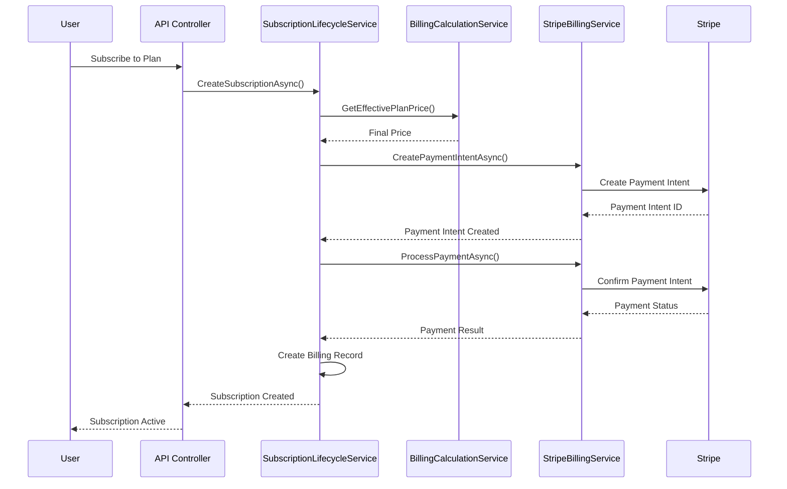
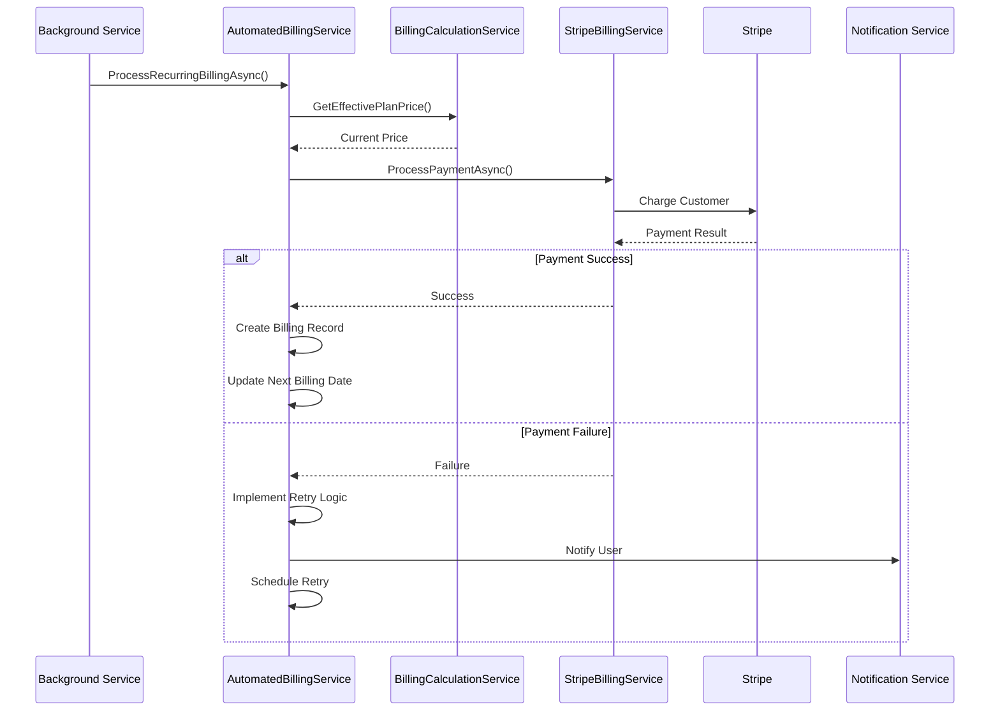

# SmartTeleHealth Subscription Billing & Payment System Documentation

## Table of Contents
1. [System Overview](#system-overview)
2. [Architecture & Components](#architecture--components)
3. [Pricing Model Implementation](#pricing-model-implementation)
4. [User Scenarios & Workflows](#user-scenarios--workflows)
5. [Services & Entities](#services--entities)
6. [Payment Processing Flow](#payment-processing-flow)
7. [Stripe Integration](#stripe-integration)
8. [Billing Cycles & Automation](#billing-cycles--automation)
9. [Error Handling & Recovery](#error-handling--recovery)
10. [Audit & Compliance](#audit--compliance)

---

## System Overview

The SmartTeleHealth subscription billing system is a comprehensive, centralized solution that handles all aspects of subscription management, billing calculations, payment processing, and financial operations. The system is designed with healthcare-specific requirements in mind, ensuring accuracy, compliance, and auditability.

### Key Features
- **Centralized Pricing Logic**: Single source of truth for all billing calculations
- **Admin-Controlled Discounts**: Only admin-set discount percentages are applied
- **Automated Billing**: Recurring billing with failed payment retry mechanisms
- **Stripe Integration**: Real-time synchronization with Stripe payment processing
- **Comprehensive Audit Trail**: Full logging of all billing operations
- **Multi-Currency Support**: International pricing and currency conversion
- **Provider Payout Management**: Automated provider commission calculations

---

## Architecture & Components

### Core Architecture Principles
1. **Centralized Calculation Logic**: All pricing calculations use `BillingCalculationService`
2. **Admin-Only Discount Control**: No automatic discounts or promotional codes
3. **Sequential Pricing Model**: Base Price → Discount Percentage → Billing Discount Percentage
4. **Real-time Stripe Sync**: All changes synchronized with Stripe immediately
5. **Comprehensive Validation**: All calculations validated before processing

### System Layers
```
┌─────────────────────────────────────────────────────────────┐
│                    API Controllers                         │
├─────────────────────────────────────────────────────────────┤
│                 Application Services                        │
├─────────────────────────────────────────────────────────────┤
│              Centralized Utility Services                   │
├─────────────────────────────────────────────────────────────┤
│                    Core Entities                           │
├─────────────────────────────────────────────────────────────┤
│                  Data Repositories                         │
├─────────────────────────────────────────────────────────────┤
│                   Database Layer                           │
└─────────────────────────────────────────────────────────────┘
```

---

## Pricing Model Implementation

### Required Pricing Model
The system implements the exact pricing model as specified:

```csharp
// Base pricing
public decimal BasePrice { get; set; }                     // Base plan price (PrivilegesTotalCost + AdminCommission)
public decimal? DiscountPercentage { get; set; }          // Promotional or admin-defined discount (%)
public DateTime? DiscountValidUntil { get; set; }         // Discount validity end date
public decimal? BillingDiscountPercentage { get; set; }   // Billing cycle discount (%)

// Auto-calculation
public bool IsAutoCalculatedPrice { get; set; }           // Indicates if price is auto-calculated
public decimal PrivilegesTotalCost { get; set; }          // Sum of all privilege costs
public decimal? AdminCommissionPercent { get; set; }      // Admin commission percentage
```

### Sequential Calculation Logic

#### Step 1: Calculate Base Price
```csharp
BasePrice = PrivilegesTotalCost + (PrivilegesTotalCost * (AdminCommissionPercent ?? 0) / 100);
```

**Example:**
- PrivilegesTotalCost = $1000
- AdminCommissionPercent = 20%
- BasePrice = $1000 + ($1000 × 0.20) = $1200

#### Step 2: Apply Promotional/Admin Discount
```csharp
AfterDiscount = BasePrice * (1 - ((DiscountPercentage ?? 0) / 100));
```

**Example:**
- DiscountPercentage = 10%
- AfterDiscount = $1200 × 0.90 = $1080

#### Step 3: Apply Billing Discount
```csharp
FinalPrice = AfterDiscount * (1 - ((BillingDiscountPercentage ?? 0) / 100));
```

**Example:**
- BillingDiscountPercentage = 5%
- FinalPrice = $1080 × 0.95 = $1026

### Centralized Implementation
All calculations are performed by `BillingCalculationService.GetEffectivePlanPrice()`:

```csharp
public static decimal GetEffectivePlanPrice(SubscriptionPlan plan, ILogger? logger = null)
{
    // Step 1: Start with base price
    decimal price = plan.BasePrice;
    
    // Step 2: Apply promotional discount if valid
    if (plan.DiscountPercentage.HasValue && plan.DiscountPercentage.Value > 0 &&
        (!plan.DiscountValidUntil.HasValue || plan.DiscountValidUntil.Value >= DateTime.UtcNow))
    {
        price = price * (1 - (plan.DiscountPercentage.Value / 100));
    }
    
    // Step 3: Apply billing discount
    if (plan.BillingDiscountPercentage.HasValue && plan.BillingDiscountPercentage.Value > 0)
    {
        price = price * (1 - (plan.BillingDiscountPercentage.Value / 100));
    }
    
    return Math.Max(price, 0); // Ensure price doesn't go negative
}
```

---

## User Scenarios & Workflows

### Scenario 1: Admin Creates Subscription Plan

#### Workflow Steps:
1. **Admin Access**: Admin logs into admin portal
2. **Plan Creation**: Admin creates new subscription plan
3. **Privilege Assignment**: Admin assigns privileges with quantities
4. **Pricing Configuration**: Admin sets commission percentage and discounts
5. **Auto-Calculation**: System calculates base price automatically
6. **Stripe Sync**: Plan synchronized with Stripe (Product + Price)
7. **Activation**: Plan becomes available for user subscription

#### Technical Flow:
```
Admin Portal → SubscriptionPlanController → PlanPricingService → BillingCalculationService → StripeSynchronizationService
```

#### Key Services Involved:
- `SubscriptionPlanService`: Plan creation and management
- `PlanPricingService`: Price calculation and validation
- `BillingCalculationService`: Centralized pricing logic
- `StripeSynchronizationService`: Stripe integration

### Scenario 2: User Subscribes to Plan

#### Workflow Steps:
1. **Plan Selection**: User browses available plans
2. **Plan Details**: User views pricing breakdown and features
3. **Payment Method**: User adds/selects payment method
4. **Subscription Creation**: System creates subscription record
5. **Stripe Customer**: Customer created/updated in Stripe
6. **Payment Processing**: Initial payment processed
7. **Subscription Activation**: User gains access to plan features

#### Technical Flow:
```
User Portal → SubscriptionController → SubscriptionLifecycleService → StripeBillingService → Payment Processing
```

#### Key Services Involved:
- `SubscriptionLifecycleService`: Subscription management
- `StripeBillingService`: Payment processing
- `BillingCalculationService`: Price validation
- `AutomatedBillingService`: Recurring billing setup

### Scenario 3: Automated Recurring Billing

#### Workflow Steps:
1. **Scheduled Check**: Background service checks for due subscriptions
2. **Price Calculation**: System calculates current billing amount
3. **Payment Processing**: Attempts to charge user's payment method
4. **Success Handling**: Updates subscription and billing records
5. **Failure Handling**: Implements retry logic and notifications
6. **Audit Logging**: Records all billing activities

#### Technical Flow:
```
Background Service → AutomatedBillingService → StripeBillingService → BillingRecord Creation → Audit Logging
```

#### Key Services Involved:
- `AutomatedBillingService`: Recurring billing automation
- `StripeBillingService`: Payment processing
- `BillingCalculationService`: Amount calculation
- `AuditService`: Activity logging

### Scenario 4: Plan Upgrade/Downgrade

#### Workflow Steps:
1. **User Request**: User requests plan change
2. **Proration Calculation**: System calculates prorated amounts
3. **Payment Processing**: Processes upgrade charge or refund
4. **Plan Update**: Updates user's subscription
5. **Stripe Sync**: Synchronizes changes with Stripe
6. **Feature Access**: Updates user's feature access

#### Technical Flow:
```
User Portal → SubscriptionController → SubscriptionLifecycleService → Proration Calculation → Stripe Sync
```

#### Key Services Involved:
- `SubscriptionLifecycleService`: Plan change management
- `BillingCalculationService`: Proration calculations
- `StripeSynchronizationService`: Stripe updates

### Scenario 5: Payment Failure & Recovery

#### Workflow Steps:
1. **Payment Failure**: Stripe webhook notifies of failed payment
2. **Retry Logic**: System implements exponential backoff retry
3. **User Notification**: User notified of payment issues
4. **Grace Period**: Subscription remains active during grace period
5. **Final Attempt**: Last retry attempt before suspension
6. **Suspension**: Subscription suspended if payment fails

#### Technical Flow:
```
Stripe Webhook → WebhookController → AutomatedBillingService → Retry Logic → User Notification
```

#### Key Services Involved:
- `WebhookController`: Stripe webhook handling
- `AutomatedBillingService`: Retry logic and recovery
- `NotificationService`: User communication

---

## Services & Entities

### Core Services

#### 1. BillingCalculationService (Static Utility)
**Purpose**: Single source of truth for all billing calculations
**Key Methods**:
- `GetEffectivePlanPrice()`: Calculates final plan price with discounts
- `CalculateFinalPlanPrice()`: Calculates base price with commission
- `CalculatePrivilegeCost()`: Calculates individual privilege costs
- `CalculateAdminCommission()`: Calculates admin commission
- `CalculateFinalBillingAmount()`: Calculates final billing amount
- `ValidateBillingCalculation()`: Validates calculation accuracy

#### 2. PlanPricingService
**Purpose**: Manages subscription plan pricing operations
**Key Methods**:
- `CalculatePlanPriceAsync()`: Calculates plan price (auto/manual)
- `CalculatePricingBreakdownAsync()`: Provides detailed pricing breakdown
- `CalculateEffectivePriceAsync()`: Gets effective price for billing
- `GetEffectivePriceAsync()`: Consistent pricing across services

#### 3. AutomatedBillingService
**Purpose**: Handles automated recurring billing and retries
**Key Methods**:
- `ProcessRecurringBillingAsync()`: Processes recurring payments
- `CalculateBillingAmountAsync()`: Calculates billing amounts
- `CalculateDiscountAmountAsync()`: Calculates additional discounts (returns 0)
- `RetryFailedPaymentAsync()`: Implements retry logic

#### 4. SubscriptionLifecycleService
**Purpose**: Manages subscription lifecycle operations
**Key Methods**:
- `CreateSubscriptionAsync()`: Creates new subscriptions
- `UpgradeSubscriptionAsync()`: Handles plan upgrades
- `DowngradeSubscriptionAsync()`: Handles plan downgrades
- `CancelSubscriptionAsync()`: Handles cancellations
- `PauseSubscriptionAsync()`: Handles subscription pauses

#### 5. StripeBillingService
**Purpose**: Handles Stripe payment processing
**Key Methods**:
- `CreatePaymentIntentAsync()`: Creates payment intents
- `ProcessPaymentAsync()`: Processes payments
- `CreateRefundAsync()`: Handles refunds
- `UpdatePaymentMethodAsync()`: Updates payment methods

#### 6. StripeSynchronizationService
**Purpose**: Synchronizes data with Stripe
**Key Methods**:
- `SynchronizeSubscriptionPlanAsync()`: Syncs plans with Stripe
- `SynchronizeCustomerAsync()`: Syncs customer data
- `SynchronizeSubscriptionAsync()`: Syncs subscription data

### Core Entities

#### 1. SubscriptionPlan
**Purpose**: Defines subscription plan structure and pricing
**Key Properties**:
- `BasePrice`: Base plan price
- `DiscountPercentage`: Admin-set promotional discount
- `BillingDiscountPercentage`: Billing cycle discount
- `PrivilegesTotalCost`: Sum of privilege costs
- `AdminCommissionPercent`: Admin commission percentage
- `IsAutoCalculatedPrice`: Auto-calculation flag

#### 2. Subscription
**Purpose**: Represents user's subscription instance
**Key Properties**:
- `CurrentPrice`: Current subscription price
- `NextBillingDate`: Next billing date
- `Status`: Subscription status
- `BillingCycle`: Billing frequency
- `PaymentMethodId`: Stripe payment method ID

#### 3. BillingRecord
**Purpose**: Records all billing transactions
**Key Properties**:
- `Amount`: Billing amount
- `Status`: Payment status
- `PaymentMethodId`: Payment method used
- `StripePaymentIntentId`: Stripe payment intent ID
- `BillingDate`: Billing date

#### 4. SubscriptionPlanPrivilege
**Purpose**: Links plans to privileges with quantities
**Key Properties**:
- `Value`: Privilege quantity (-1 = unlimited, 0 = disabled)
- `PrivilegeBaseCost`: Base cost per unit
- `UnitCost`: Overage cost per unit

#### 5. Privilege
**Purpose**: Defines individual privileges/features
**Key Properties**:
- `Name`: Privilege name
- `Description`: Privilege description
- `BaseCost`: Base cost per unit

### Repositories

#### 1. ISubscriptionPlanRepository
**Purpose**: Data access for subscription plans
**Key Methods**:
- `GetByIdWithDetailsAsync()`: Gets plan with privileges
- `GetActivePlansAsync()`: Gets active plans
- `UpdateAsync()`: Updates plan data

#### 2. ISubscriptionRepository
**Purpose**: Data access for subscriptions
**Key Methods**:
- `GetByIdWithDetailsAsync()`: Gets subscription with plan
- `GetUserSubscriptionsAsync()`: Gets user's subscriptions
- `GetDueForBillingAsync()`: Gets subscriptions due for billing

#### 3. IBillingRecordRepository
**Purpose**: Data access for billing records
**Key Methods**:
- `CreateAsync()`: Creates billing record
- `GetBySubscriptionAsync()`: Gets subscription billing history
- `UpdateStatusAsync()`: Updates payment status

---

## Payment Processing Flow

### Initial Subscription Payment



### Recurring Billing Process



---

## Stripe Integration

### Stripe Objects Managed

#### 1. Customer
- **Purpose**: Represents users in Stripe
- **Sync**: Real-time synchronization
- **Key Fields**: Email, name, payment methods

#### 2. Product
- **Purpose**: Represents subscription plans
- **Sync**: Created when plan is created
- **Key Fields**: Name, description, metadata

#### 3. Price
- **Purpose**: Represents plan pricing
- **Sync**: Created/updated when plan pricing changes
- **Key Fields**: Amount, currency, billing period

#### 4. PaymentIntent
- **Purpose**: Represents payment attempts
- **Sync**: Created for each billing attempt
- **Key Fields**: Amount, currency, payment method

#### 5. Subscription
- **Purpose**: Represents Stripe subscriptions
- **Sync**: Created when user subscribes
- **Key Fields**: Customer, price, status

### Webhook Handling

#### Supported Webhooks:
- `payment_intent.succeeded`: Payment successful
- `payment_intent.payment_failed`: Payment failed
- `invoice.payment_succeeded`: Recurring payment successful
- `invoice.payment_failed`: Recurring payment failed
- `customer.subscription.updated`: Subscription updated
- `customer.subscription.deleted`: Subscription cancelled

#### Webhook Processing:
```csharp
[HttpPost("webhook")]
public async Task<IActionResult> HandleWebhook()
{
    var json = await new StreamReader(HttpContext.Request.Body).ReadToEndAsync();
    var stripeEvent = EventUtility.ParseEvent(json);
    
    switch (stripeEvent.Type)
    {
        case Events.PaymentIntentSucceeded:
            await HandlePaymentSuccess(stripeEvent);
            break;
        case Events.PaymentIntentPaymentFailed:
            await HandlePaymentFailure(stripeEvent);
            break;
        // ... other webhook handlers
    }
    
    return Ok();
}
```

---

## Billing Cycles & Automation

### Supported Billing Cycles
- **Daily**: Every day
- **Weekly**: Every week
- **Monthly**: Every month (default)
- **Quarterly**: Every 3 months
- **Annual**: Every 12 months

### Automation Features

#### 1. Recurring Billing
- **Frequency**: Configurable per plan
- **Timing**: Automated background processing
- **Retry Logic**: Exponential backoff for failures

#### 2. Failed Payment Recovery
- **Retry Attempts**: Up to 3 attempts
- **Retry Intervals**: 1 day, 3 days, 7 days
- **Grace Period**: 7 days before suspension
- **Notifications**: Email/SMS notifications

#### 3. Subscription Management
- **Auto-renewal**: Automatic renewal processing
- **Proration**: Automatic proration for plan changes
- **Suspension**: Automatic suspension for failed payments

### Background Service Configuration
```csharp
public class BillingBackgroundService : BackgroundService
{
    protected override async Task ExecuteAsync(CancellationToken stoppingToken)
    {
        while (!stoppingToken.IsCancellationRequested)
        {
            await ProcessRecurringBilling();
            await Task.Delay(TimeSpan.FromHours(1), stoppingToken);
        }
    }
}
```

---

## Error Handling & Recovery

### Error Categories

#### 1. Payment Processing Errors
- **Insufficient Funds**: Retry with exponential backoff
- **Card Declined**: Immediate retry with different payment method
- **Network Errors**: Retry with exponential backoff
- **Stripe API Errors**: Log and retry based on error type

#### 2. Calculation Errors
- **Invalid Pricing**: Fallback to base price
- **Missing Data**: Use default values
- **Validation Failures**: Log and alert administrators

#### 3. System Errors
- **Database Errors**: Retry with exponential backoff
- **Service Unavailable**: Circuit breaker pattern
- **Timeout Errors**: Retry with exponential backoff

### Recovery Mechanisms

#### 1. Saga Pattern Implementation
```csharp
public class SagaCoordinator
{
    public async Task<bool> ExecuteSagaAsync(List<SagaStep> steps)
    {
        var compensations = new List<Func<Task>>();
        
        try
        {
            foreach (var step in steps)
            {
                await step.ExecuteAsync();
                compensations.Add(step.Compensation);
            }
            return true;
        }
        catch (Exception ex)
        {
            // Execute compensations in reverse order
            foreach (var compensation in compensations.AsEnumerable().Reverse())
            {
                await compensation();
            }
            return false;
        }
    }
}
```

#### 2. Circuit Breaker Pattern
```csharp
public class CircuitBreaker
{
    private int _failureCount = 0;
    private DateTime _lastFailureTime = DateTime.MinValue;
    
    public async Task<T> ExecuteAsync<T>(Func<Task<T>> operation)
    {
        if (IsCircuitOpen())
        {
            throw new CircuitBreakerOpenException();
        }
        
        try
        {
            var result = await operation();
            ResetCircuit();
            return result;
        }
        catch (Exception ex)
        {
            RecordFailure();
            throw;
        }
    }
}
```

---

## Audit & Compliance

### Audit Trail Requirements

#### 1. Financial Audit Trail
- **All Billing Calculations**: Logged with inputs and outputs
- **Payment Attempts**: Complete payment history
- **Refund Operations**: Full refund audit trail
- **Price Changes**: Historical pricing changes

#### 2. Operational Audit Trail
- **User Actions**: All user-initiated changes
- **Admin Actions**: All administrative operations
- **System Events**: Automated system operations
- **Error Events**: All error conditions and resolutions

### Compliance Features

#### 1. Data Integrity
- **Immutable Records**: Billing records cannot be modified
- **Version Control**: Plan versioning for changes
- **Data Validation**: Comprehensive input validation
- **Consistency Checks**: Regular data consistency validation

#### 2. Security Measures
- **Encryption**: All sensitive data encrypted
- **Access Control**: Role-based access control
- **Audit Logging**: Complete audit trail
- **Data Retention**: Configurable data retention policies

### Audit Service Implementation
```csharp
public class AuditService
{
    public async Task LogBillingEventAsync(string eventType, Guid subscriptionId, object data)
    {
        var auditLog = new AuditLog
        {
            Type = eventType,
            TableName = "BillingRecords",
            PrimaryKey = subscriptionId.ToString(),
            NewValues = JsonSerializer.Serialize(data),
            DateTime = DateTime.UtcNow
        };
        
        await _auditRepository.CreateAsync(auditLog);
    }
}
```

---

## Conclusion

The SmartTeleHealth subscription billing system provides a comprehensive, centralized, and compliant solution for managing subscription-based healthcare services. The system's architecture ensures accuracy, reliability, and maintainability while providing the flexibility needed for complex healthcare billing scenarios.

### Key Benefits:
1. **Centralized Logic**: Single source of truth for all calculations
2. **Admin Control**: Complete control over pricing and discounts
3. **Automated Processing**: Reliable recurring billing automation
4. **Real-time Sync**: Immediate Stripe synchronization
5. **Comprehensive Audit**: Complete audit trail for compliance
6. **Error Recovery**: Robust error handling and recovery mechanisms
7. **Scalability**: Designed to handle high-volume operations

### Future Enhancements:
1. **Multi-tenant Support**: Support for multiple healthcare organizations
2. **Advanced Analytics**: Comprehensive billing analytics and reporting
3. **API Rate Limiting**: Enhanced API protection
4. **Machine Learning**: Predictive analytics for payment failures
5. **Mobile Integration**: Enhanced mobile payment processing

This documentation provides a complete understanding of the billing system's architecture, implementation, and operation, enabling effective system management and future development.


