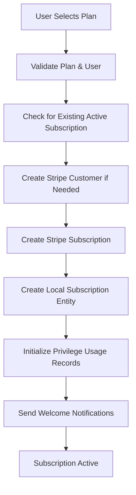
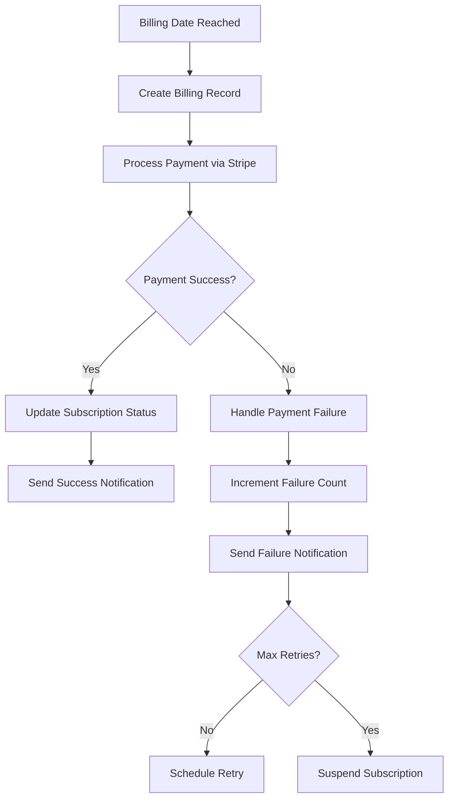

# Comprehensive Subscription Management System Architecture

## Table of Contents
1. [System Overview](#system-overview)
2. [Core Data Model](#core-data-model)
3. [Subscription Lifecycle Management](#subscription-lifecycle-management)
4. [Billing and Payment Processing](#billing-and-payment-processing)
5. [Stripe Integration](#stripe-integration)
6. [Privilege Management System](#privilege-management-system)
7. [Analytics and Reporting](#analytics-and-reporting)
8. [User Subscription Management](#user-subscription-management)
9. [Webhook Handling and Event Processing](#webhook-handling-and-event-processing)
10. [Background Services and Automation](#background-services-and-automation)
11. [API Architecture](#api-architecture)
12. [Security and Access Control](#security-and-access-control)
13. [Error Handling and Resilience](#error-handling-and-resilience)
14. [Performance Considerations](#performance-considerations)

## System Overview

The SmartTeleHealth Subscription Management System is a comprehensive, enterprise-grade solution built on .NET 8 that handles the complete subscription lifecycle for telehealth services. The system integrates with Stripe for payment processing and provides sophisticated privilege management, analytics, and automation capabilities.

### Key Features
- **Complete Subscription Lifecycle Management**: From creation to cancellation
- **Stripe Integration**: Full payment processing and webhook handling
- **Privilege-Based Access Control**: Granular permission system with usage tracking
- **Advanced Analytics**: Comprehensive reporting and business intelligence
- **Automated Billing**: Background services for recurring payments
- **Multi-tenant Architecture**: Support for different user roles and access levels
- **Real-time Synchronization**: Webhook-driven updates between Stripe and local database

## Core Data Model

### 1. Subscription Entity
The central entity that manages user subscriptions with comprehensive status tracking:

```csharp
public class Subscription : BaseEntity
{
    // Core Properties
    public Guid Id { get; set; }
    public int UserId { get; set; }
    public Guid SubscriptionPlanId { get; set; }
    public Guid BillingCycleId { get; set; }
    public int? ProviderId { get; set; }
    
    // Status Management
    public string Status { get; set; } = SubscriptionStatuses.Pending;
    public string? StatusReason { get; set; }
    
    // Lifecycle Dates
    public DateTime StartDate { get; set; }
    public DateTime? EndDate { get; set; }
    public DateTime NextBillingDate { get; set; }
    public DateTime? PausedDate { get; set; }
    public DateTime? ResumedDate { get; set; }
    public DateTime? CancelledDate { get; set; }
    public DateTime? ExpirationDate { get; set; }
    
    // Stripe Integration
    public string? StripeSubscriptionId { get; set; }
    public string? StripeCustomerId { get; set; }
    public string? StripePriceId { get; set; }
    public string? PaymentMethodId { get; set; }
    
    // Trial Management
    public bool IsTrialSubscription { get; set; }
    public DateTime? TrialStartDate { get; set; }
    public DateTime? TrialEndDate { get; set; }
    public int TrialDurationInDays { get; set; }
    
    // Usage Tracking
    public DateTime? LastUsedDate { get; set; }
    public int TotalUsageCount { get; set; }
    
    // Payment Tracking
    public DateTime? LastPaymentDate { get; set; }
    public DateTime? LastPaymentFailedDate { get; set; }
    public string? LastPaymentError { get; set; }
    public int FailedPaymentAttempts { get; set; }
}
```

**Subscription Statuses:**
- `Pending`: Created but not yet activated
- `Active`: Fully functional with valid payments
- `Paused`: Temporarily suspended by user or system
- `Cancelled`: Permanently terminated
- `Expired`: Reached natural end or payment issues
- `PaymentFailed`: Payment processing issues
- `TrialActive`: In trial period
- `TrialExpired`: Trial period ended
- `Suspended`: Administrative suspension

### 2. SubscriptionPlan Entity
Defines available subscription plans with features and pricing:

```csharp
public class SubscriptionPlan : BaseEntity
{
    public Guid Id { get; set; }
    public string Name { get; set; }
    public string? Description { get; set; }
    public decimal Price { get; set; }
    public decimal? DiscountedPrice { get; set; }
    public DateTime? DiscountValidUntil { get; set; }
    
    // Billing Configuration
    public Guid BillingCycleId { get; set; }
    public Guid CurrencyId { get; set; }
    public Guid? CategoryId { get; set; }
    
    // Stripe Integration
    public string? StripeProductId { get; set; }
    public string? StripeMonthlyPriceId { get; set; }
    public string? StripeQuarterlyPriceId { get; set; }
    public string? StripeAnnualPriceId { get; set; }
    
    // Plan Features
    public bool IsTrialAllowed { get; set; }
    public int TrialDurationInDays { get; set; }
    public int MessagingCount { get; set; }
    public bool IncludesMedicationDelivery { get; set; }
    public bool IncludesFollowUpCare { get; set; }
    public int DeliveryFrequencyDays { get; set; }
    public int MaxPauseDurationDays { get; set; }
}
```

### 3. Privilege Management Entities

#### SubscriptionPlanPrivilege (Junction Entity)
Maps privileges to subscription plans with usage limits:

```csharp
public class SubscriptionPlanPrivilege : BaseEntity
{
    public Guid Id { get; set; }
    public Guid SubscriptionPlanId { get; set; }
    public Guid PrivilegeId { get; set; }
    public int Value { get; set; } // -1 = unlimited, 0 = disabled, >0 = limited
    public Guid UsagePeriodId { get; set; }
    
    // Time-based Limits
    public int? DailyLimit { get; set; }
    public int? WeeklyLimit { get; set; }
    public int? MonthlyLimit { get; set; }
    
    // Navigation Properties
    public virtual SubscriptionPlan SubscriptionPlan { get; set; }
    public virtual Privilege Privilege { get; set; }
    public virtual MasterBillingCycle UsagePeriod { get; set; }
}
```

#### UserSubscriptionPrivilegeUsage
Tracks actual privilege usage by users:

```csharp
public class UserSubscriptionPrivilegeUsage : BaseEntity
{
    public Guid Id { get; set; }
    public Guid SubscriptionId { get; set; }
    public Guid SubscriptionPlanPrivilegeId { get; set; }
    public int UsedValue { get; set; }
    public int AllowedValue { get; set; }
    public DateTime UsagePeriodStart { get; set; }
    public DateTime UsagePeriodEnd { get; set; }
    public DateTime? LastUsedAt { get; set; }
    
    // Navigation Properties
    public virtual Subscription Subscription { get; set; }
    public virtual SubscriptionPlanPrivilege SubscriptionPlanPrivilege { get; set; }
    public virtual ICollection<PrivilegeUsageHistory> UsageHistory { get; set; }
}
```

### 4. BillingRecord Entity
Comprehensive billing and payment tracking:

```csharp
public class BillingRecord : BaseEntity
{
    public Guid Id { get; set; }
    public int UserId { get; set; }
    public Guid? SubscriptionId { get; set; }
    public Guid? ConsultationId { get; set; }
    public Guid? MedicationDeliveryId { get; set; }
    public Guid CurrencyId { get; set; }
    
    // Billing Details
    public BillingStatus Status { get; set; }
    public BillingType Type { get; set; }
    public decimal Amount { get; set; }
    public decimal TaxAmount { get; set; }
    public decimal ShippingAmount { get; set; }
    public decimal TotalAmount { get; set; }
    
    // Payment Information
    public DateTime BillingDate { get; set; }
    public DateTime? PaidAt { get; set; }
    public DateTime? DueDate { get; set; }
    public string? InvoiceNumber { get; set; }
    public string? StripePaymentIntentId { get; set; }
    public string? StripeInvoiceId { get; set; }
    
    // Error Handling
    public string? FailureReason { get; set; }
    public string? ErrorMessage { get; set; }
    public string? PaymentMethod { get; set; }
    public string? TransactionId { get; set; }
}
```

## Subscription Lifecycle Management

### 1. Subscription Creation Flow



**Key Steps:**
1. **Plan Validation**: Verify plan exists and is active
2. **Duplicate Prevention**: Check for existing active subscriptions
3. **Stripe Integration**: Create customer and subscription in Stripe
4. **Local Entity Creation**: Create subscription with Stripe IDs
5. **Privilege Initialization**: Set up usage tracking records
6. **Notification**: Send welcome emails and notifications

### 2. Status Transition Management

The system enforces strict status transition rules:

```csharp
public string[] GetValidStatusTransitions()
{
    return Status switch
    {
        SubscriptionStatuses.Pending => new[] { 
            SubscriptionStatuses.Active, 
            SubscriptionStatuses.TrialActive, 
            SubscriptionStatuses.Cancelled 
        },
        SubscriptionStatuses.Active => new[] { 
            SubscriptionStatuses.Paused, 
            SubscriptionStatuses.Cancelled, 
            SubscriptionStatuses.Expired, 
            SubscriptionStatuses.PaymentFailed 
        },
        SubscriptionStatuses.Paused => new[] { 
            SubscriptionStatuses.Active, 
            SubscriptionStatuses.Cancelled, 
            SubscriptionStatuses.Expired 
        },
        // ... other transitions
    };
}
```

### 3. Trial Management

**Trial Subscription Flow:**
1. User selects plan with trial option
2. System creates subscription with `TrialActive` status
3. Trial period calculated based on plan configuration
4. User gets full access to plan privileges during trial
5. Before trial expires, system sends upgrade notifications
6. On trial expiration, subscription converts to `Active` or `TrialExpired`

**Trial Conversion Logic:**
```csharp
if (subscription.IsInTrial && subscription.TrialEndDate <= DateTime.UtcNow)
{
    if (subscription.AutoRenew && !string.IsNullOrEmpty(subscription.PaymentMethodId))
    {
        // Convert to active with payment
        subscription.Status = SubscriptionStatuses.Active;
        subscription.IsTrialSubscription = false;
    }
    else
    {
        // Mark as trial expired
        subscription.Status = SubscriptionStatuses.TrialExpired;
    }
}
```

## Billing and Payment Processing

### 1. Billing Cycle Management

The system supports multiple billing cycles:
- **Monthly**: 30-day cycles
- **Quarterly**: 90-day cycles  
- **Annual**: 365-day cycles

**Billing Date Calculation:**
```csharp
public DateTime CalculateNextBillingDate(DateTime currentDate, BillingCycle cycle)
{
    return cycle.Name.ToLower() switch
    {
        "monthly" => currentDate.AddMonths(1),
        "quarterly" => currentDate.AddMonths(3),
        "annual" => currentDate.AddYears(1),
        _ => currentDate.AddDays(cycle.DurationInDays)
    };
}
```

### 2. Payment Processing Flow



### 3. Payment Failure Handling

**Retry Logic:**
- First failure: Retry after 1 day
- Second failure: Retry after 3 days
- Third failure: Retry after 7 days
- Fourth failure: Suspend subscription

**Failure Tracking:**
```csharp
public class PaymentFailureHandling
{
    public async Task HandlePaymentFailure(Subscription subscription, string errorMessage)
    {
        subscription.FailedPaymentAttempts++;
        subscription.LastPaymentFailedDate = DateTime.UtcNow;
        subscription.LastPaymentError = errorMessage;
        
        if (subscription.FailedPaymentAttempts >= 4)
        {
            subscription.Status = SubscriptionStatuses.Suspended;
            await SendSuspensionNotification(subscription);
        }
        else
        {
            subscription.Status = SubscriptionStatuses.PaymentFailed;
            await ScheduleRetry(subscription);
        }
    }
}
```

## Stripe Integration

### 1. Customer Management

**Customer Creation:**
```csharp
public async Task<string> CreateCustomerAsync(string email, string fullName, TokenModel tokenModel)
{
    var customerOptions = new CustomerCreateOptions
    {
        Email = email,
        Name = fullName,
        Metadata = new Dictionary<string, string>
        {
            { "user_id", tokenModel.UserID.ToString() },
            { "created_by", "smart_telehealth" }
        }
    };
    
    var customer = await _stripeService.Customers.CreateAsync(customerOptions);
    return customer.Id;
}
```

### 2. Subscription Management

**Subscription Creation:**
```csharp
public async Task<string> CreateSubscriptionAsync(string customerId, string priceId, string paymentMethodId, TokenModel tokenModel)
{
    var subscriptionOptions = new SubscriptionCreateOptions
    {
        Customer = customerId,
        Items = new List<SubscriptionItemOptions>
        {
            new SubscriptionItemOptions
            {
                Price = priceId
            }
        },
        DefaultPaymentMethod = paymentMethodId,
        PaymentBehavior = "default_incomplete",
        PaymentSettings = new SubscriptionPaymentSettingsOptions
        {
            SaveDefaultPaymentMethod = "on_subscription"
        },
        Expand = new List<string> { "latest_invoice.payment_intent" }
    };
    
    var subscription = await _stripeService.Subscriptions.CreateAsync(subscriptionOptions);
    return subscription.Id;
}
```

### 3. Webhook Processing

**Webhook Event Handling:**
```csharp
public async Task ProcessStripeEvent(Event stripeEvent)
{
    switch (stripeEvent.Type)
    {
        case "customer.subscription.created":
            await HandleSubscriptionCreated(stripeEvent);
            break;
        case "customer.subscription.updated":
            await HandleSubscriptionUpdated(stripeEvent);
            break;
        case "customer.subscription.deleted":
            await HandleSubscriptionDeleted(stripeEvent);
            break;
        case "invoice.payment_succeeded":
            await HandlePaymentSucceeded(stripeEvent);
            break;
        case "invoice.payment_failed":
            await HandlePaymentFailed(stripeEvent);
            break;
        // ... other event types
    }
}
```

**Webhook Security:**
- Signature verification using Stripe webhook secret
- Idempotency handling to prevent duplicate processing
- Retry logic with exponential backoff
- Comprehensive error logging and monitoring

## Privilege Management System

### 1. Privilege Definition

Privileges define what actions users can perform:

```csharp
public class Privilege : BaseEntity
{
    public Guid Id { get; set; }
    public string Name { get; set; }
    public string? Description { get; set; }
    public Guid PrivilegeTypeId { get; set; }
    
    // Navigation Properties
    public virtual MasterPrivilegeType PrivilegeType { get; set; }
    public virtual ICollection<SubscriptionPlanPrivilege> PlanPrivileges { get; set; }
    public virtual ICollection<UserSubscriptionPrivilegeUsage> UsageRecords { get; set; }
}
```

### 2. Usage Tracking and Enforcement

**Privilege Usage Validation:**
```csharp
public async Task<bool> UsePrivilegeAsync(Guid subscriptionId, string privilegeName, int amount, TokenModel tokenModel)
{
    // Get plan privilege configuration
    var planPrivilege = await GetPlanPrivilegeAsync(subscriptionId, privilegeName);
    if (planPrivilege == null) return false;
    
    // Check if privilege is disabled
    if (planPrivilege.Value == 0) return false;
    
    // Check time-based limits
    if (!await CheckTimeBasedLimitsAsync(subscriptionId, planPrivilege, amount))
        return false;
    
    // Handle unlimited privileges
    if (planPrivilege.Value == -1)
    {
        await RecordUnlimitedUsageAsync(subscriptionId, planPrivilege, amount, tokenModel);
        return true;
    }
    
    // Check remaining usage for limited privileges
    var remaining = await GetRemainingPrivilegeAsync(subscriptionId, privilegeName, tokenModel);
    if (remaining < amount) return false;
    
    // Record usage
    await RecordLimitedUsageAsync(subscriptionId, planPrivilege, amount, tokenModel);
    return true;
}
```

### 3. Time-Based Limits

The system supports multiple time-based restrictions:

**Daily Limits:**
```csharp
private async Task<bool> CheckDailyLimitAsync(Guid subscriptionId, SubscriptionPlanPrivilege planPrivilege, int amount)
{
    if (!planPrivilege.DailyLimit.HasValue) return true;
    
    var today = DateTime.UtcNow.Date;
    var todayUsage = await _usageRepo.GetUsageByDateRangeAsync(
        subscriptionId, 
        planPrivilege.Id, 
        today, 
        today.AddDays(1)
    );
    
    return (todayUsage + amount) <= planPrivilege.DailyLimit.Value;
}
```

**Weekly and Monthly Limits:**
Similar logic applies for weekly and monthly limits with appropriate date range calculations.

## Analytics and Reporting

### 1. Subscription Analytics

**Key Metrics:**
- Total Subscriptions
- Active Subscriptions
- Churn Rate
- Monthly Recurring Revenue (MRR)
- Annual Recurring Revenue (ARR)
- Average Revenue Per User (ARPU)
- Customer Lifetime Value (CLV)

**Analytics Service:**
```csharp
public async Task<JsonModel> GetSubscriptionAnalyticsAsync(DateTime? startDate, DateTime? endDate, TokenModel tokenModel)
{
    var start = startDate ?? DateTime.UtcNow.AddMonths(-12);
    var end = endDate ?? DateTime.UtcNow;
    
    var analytics = new
    {
        Period = new { StartDate = start, EndDate = end },
        SubscriptionMetrics = await CalculateSubscriptionMetricsAsync(subscriptions, start, end),
        RevenueMetrics = await CalculateRevenueMetricsAsync(billingRecords, start, end),
        ChurnMetrics = await CalculateChurnMetricsAsync(subscriptions, start, end),
        GrowthMetrics = await CalculateGrowthMetricsAsync(subscriptions, start, end),
        PlanDistribution = await CalculatePlanDistributionAsync(subscriptions),
        GeographicDistribution = await CalculateGeographicDistributionAsync(subscriptions),
        UserEngagement = await CalculateUserEngagementAsync(subscriptions, start, end)
    };
    
    return new JsonModel { data = analytics, Message = "Analytics retrieved successfully", StatusCode = 200 };
}
```

### 2. Revenue Analytics

**MRR Calculation:**
```csharp
public async Task<decimal> CalculateMRRAsync(DateTime date)
{
    var activeSubscriptions = await _subscriptionRepository.GetActiveSubscriptionsAsync();
    var mrr = activeSubscriptions
        .Where(s => s.Status == "Active" && s.StartDate <= date)
        .Sum(s => s.CurrentPrice);
    
    return mrr;
}
```

**Churn Rate Calculation:**
```csharp
public async Task<decimal> CalculateChurnRateAsync(DateTime startDate, DateTime endDate)
{
    var periodStart = startDate;
    var periodEnd = endDate;
    
    var subscriptionsAtStart = await _subscriptionRepository.GetActiveSubscriptionsAtDateAsync(periodStart);
    var churnedSubscriptions = await _subscriptionRepository.GetChurnedSubscriptionsAsync(periodStart, periodEnd);
    
    var churnRate = (decimal)churnedSubscriptions.Count() / subscriptionsAtStart.Count() * 100;
    return churnRate;
}
```

### 3. Report Generation

**PDF Report Generation:**
```csharp
public async Task<JsonModel> GenerateSubscriptionReportAsync(DateTime? startDate, DateTime? endDate, TokenModel tokenModel)
{
    var reportData = new
    {
        Period = new { StartDate = startDate, EndDate = endDate },
        SubscriptionAnalytics = await GetSubscriptionAnalyticsAsync(startDate, endDate, tokenModel),
        RevenueAnalytics = await GetRevenueAnalyticsAsync(startDate, endDate, tokenModel),
        TopCategories = await GetTopCategoriesAsync(startDate, endDate, tokenModel),
        GeneratedAt = DateTime.UtcNow,
        GeneratedBy = tokenModel?.UserID ?? 0
    };
    
    return new JsonModel { data = reportData, Message = "Report generated successfully", StatusCode = 200 };
}
```

## User Subscription Management

### 1. User Subscription Dashboard

**Dashboard Data Aggregation:**
```csharp
public async Task<JsonModel> GetUserSubscriptionDashboardAsync(int userId, TokenModel tokenModel)
{
    var userSubscriptions = await _subscriptionRepository.GetByUserIdAsync(userId);
    var activeSubscription = userSubscriptions.FirstOrDefault(s => s.Status == "Active");
    
    var dashboard = new
    {
        ActiveSubscription = activeSubscription != null ? _mapper.Map<SubscriptionDto>(activeSubscription) : null,
        AllSubscriptions = _mapper.Map<List<SubscriptionDto>>(userSubscriptions),
        UsageStatistics = await GetUserUsageStatisticsAsync(userId, tokenModel),
        BillingHistory = await GetUserBillingHistoryAsync(userId, tokenModel),
        UpcomingBilling = await GetUpcomingBillingAsync(userId, tokenModel)
    };
    
    return new JsonModel { data = dashboard, Message = "Dashboard data retrieved successfully", StatusCode = 200 };
}
```

### 2. Subscription Management Operations

**Pause Subscription:**
```csharp
public async Task<JsonModel> PauseSubscriptionAsync(string subscriptionId, TokenModel tokenModel)
{
    var subscription = await _subscriptionRepository.GetByIdAsync(Guid.Parse(subscriptionId));
    if (subscription == null)
        return new JsonModel { data = new object(), Message = "Subscription not found", StatusCode = 404 };
    
    if (!subscription.CanPause)
        return new JsonModel { data = new object(), Message = "Subscription cannot be paused", StatusCode = 400 };
    
    subscription.Status = Subscription.SubscriptionStatuses.Paused;
    subscription.PausedDate = DateTime.UtcNow;
    subscription.PauseReason = "User requested pause";
    
    await _subscriptionRepository.UpdateAsync(subscription);
    
    // Synchronize with Stripe
    await _stripeService.PauseSubscriptionAsync(subscription.StripeSubscriptionId, tokenModel);
    
    return new JsonModel { data = true, Message = "Subscription paused successfully", StatusCode = 200 };
}
```

**Cancel Subscription:**
```csharp
public async Task<JsonModel> CancelSubscriptionAsync(string subscriptionId, string? reason, TokenModel tokenModel)
{
    var subscription = await _subscriptionRepository.GetByIdAsync(Guid.Parse(subscriptionId));
    if (subscription == null)
        return new JsonModel { data = new object(), Message = "Subscription not found", StatusCode = 404 };
    
    if (!subscription.CanCancel)
        return new JsonModel { data = new object(), Message = "Subscription cannot be cancelled", StatusCode = 400 };
    
    subscription.Status = Subscription.SubscriptionStatuses.Cancelled;
    subscription.CancelledDate = DateTime.UtcNow;
    subscription.CancellationReason = reason ?? "User requested cancellation";
    
    await _subscriptionRepository.UpdateAsync(subscription);
    
    // Synchronize with Stripe
    await _stripeService.CancelSubscriptionAsync(subscription.StripeSubscriptionId, tokenModel);
    
    return new JsonModel { data = true, Message = "Subscription cancelled successfully", StatusCode = 200 };
}
```

## Webhook Handling and Event Processing

### 1. Webhook Controller

**Stripe Webhook Processing:**
```csharp
[HttpPost]
public async Task<JsonModel> HandleWebhook()
{
    var json = await new StreamReader(HttpContext.Request.Body).ReadToEndAsync();
    var webhookSecret = _configuration["Stripe:WebhookSecret"];
    
    // Verify webhook signature
    var stripeEvent = EventUtility.ConstructEvent(
        json,
        Request.Headers["Stripe-Signature"],
        webhookSecret
    );
    
    // Process with retry logic
    await ProcessWebhookWithRetryAsync(stripeEvent);
    
    return new JsonModel { data = new object(), Message = "Webhook processed successfully", StatusCode = 200 };
}
```

### 2. Event Processing

**Subscription Events:**
```csharp
private async Task HandleSubscriptionCreated(Event stripeEvent)
{
    var subscription = stripeEvent.Data.Object as Stripe.Subscription;
    var localSubscription = await _subscriptionRepository.GetByStripeSubscriptionIdAsync(subscription.Id, null);
    
    if (localSubscription != null)
    {
        localSubscription.Status = MapStripeStatus(subscription.Status);
        await _subscriptionRepository.UpdateAsync(localSubscription);
    }
}

private async Task HandlePaymentSucceeded(Event stripeEvent)
{
    var invoice = stripeEvent.Data.Object as Stripe.Invoice;
    var subscription = await _subscriptionRepository.GetByStripeSubscriptionIdAsync(invoice.SubscriptionId, null);
    
    if (subscription != null)
    {
        subscription.Status = Subscription.SubscriptionStatuses.Active;
        subscription.LastPaymentDate = DateTime.UtcNow;
        subscription.FailedPaymentAttempts = 0;
        subscription.LastPaymentError = null;
        
        await _subscriptionRepository.UpdateAsync(subscription);
        
        // Create billing record
        await CreateBillingRecordFromInvoiceAsync(invoice, subscription);
        
        // Send payment success notification
        await _notificationService.SendPaymentSuccessEmailAsync(subscription.User.Email, subscription.User.FullName, billingRecord, null);
    }
}
```

### 3. Idempotency and Error Handling

**Webhook Idempotency:**
```csharp
private async Task ProcessWebhookWithRetryAsync(Event stripeEvent)
{
    for (int attempt = 1; attempt <= _maxRetries; attempt++)
    {
        try
        {
            // Check if event already processed
            if (await IsEventProcessedAsync(stripeEvent.Id))
            {
                _logger.LogInformation("Event {EventId} already processed, skipping", stripeEvent.Id);
                return;
            }
            
            await ProcessStripeEvent(stripeEvent);
            
            // Mark event as processed
            await MarkEventAsProcessedAsync(stripeEvent.Id);
            return;
        }
        catch (Exception ex)
        {
            if (attempt == _maxRetries)
            {
                _logger.LogError(ex, "Failed to process webhook event {EventId} after {Attempts} attempts", stripeEvent.Id, _maxRetries);
                throw;
            }
            
            await Task.Delay(_retryDelaySeconds * 1000);
        }
    }
}
```

## Background Services and Automation

### 1. Subscription Background Service

**Automated Billing Processing:**
```csharp
public class SubscriptionBackgroundService : BackgroundService
{
    private readonly TimeSpan _billingInterval = TimeSpan.FromHours(1);
    private readonly TimeSpan _lifecycleInterval = TimeSpan.FromHours(6);
    
    protected override async Task ExecuteAsync(CancellationToken stoppingToken)
    {
        while (!stoppingToken.IsCancellationRequested)
        {
            try
            {
                // Process automated billing
                await ProcessAutomatedBillingAsync(stoppingToken);
                
                // Process lifecycle management
                await ProcessLifecycleManagementAsync(stoppingToken);
                
                await Task.Delay(_billingInterval, stoppingToken);
            }
            catch (Exception ex)
            {
                _logger.LogError(ex, "Error in Subscription Background Service");
                await Task.Delay(TimeSpan.FromMinutes(5), stoppingToken);
            }
        }
    }
}
```

### 2. Automated Billing Service

**Recurring Billing Processing:**
```csharp
public async Task<JsonModel> ProcessRecurringBillingAsync(TokenModel tokenModel)
{
    var dueSubscriptions = await _subscriptionRepository.GetSubscriptionsDueForBillingAsync(DateTime.UtcNow);
    var processedCount = 0;
    var failedCount = 0;
    
    foreach (var subscription in dueSubscriptions)
    {
        try
        {
            // Create billing record
            var billingRecord = new CreateBillingRecordDto
            {
                UserId = subscription.UserId,
                SubscriptionId = subscription.Id.ToString(),
                Amount = subscription.CurrentPrice,
                Description = $"Automated billing for {subscription.SubscriptionPlan.Name}",
                DueDate = DateTime.UtcNow,
                Type = BillingRecord.BillingType.Subscription.ToString()
            };
            
            var billingResult = await _billingService.CreateBillingRecordAsync(billingRecord, tokenModel);
            if (billingResult.StatusCode == 200)
            {
                // Process payment through Stripe
                var paymentResult = await _stripeService.ProcessPaymentAsync(
                    subscription.PaymentMethodId,
                    subscription.CurrentPrice,
                    subscription.Currency,
                    tokenModel
                );
                
                if (paymentResult.Status == "succeeded")
                {
                    processedCount++;
                    await UpdateSubscriptionAfterPayment(subscription, paymentResult);
                }
                else
                {
                    failedCount++;
                    await HandlePaymentFailure(subscription, paymentResult.ErrorMessage);
                }
            }
        }
        catch (Exception ex)
        {
            _logger.LogError(ex, "Error processing billing for subscription {SubscriptionId}", subscription.Id);
            failedCount++;
        }
    }
    
    return new JsonModel 
    { 
        data = new { Processed = processedCount, Failed = failedCount }, 
        Message = "Billing processing completed", 
        StatusCode = 200 
    };
}
```

### 3. Lifecycle Management

**Subscription Expiration Processing:**
```csharp
private async Task ProcessLifecycleManagementAsync(CancellationToken stoppingToken)
{
    // Process subscription expirations
    var activeSubscriptions = await _subscriptionRepository.GetActiveSubscriptionsAsync();
    var expiredCount = 0;
    
    foreach (var subscription in activeSubscriptions)
    {
        if (subscription.NextBillingDate <= DateTime.UtcNow)
        {
            var result = await _lifecycleService.ExpireSubscriptionAsync(subscription.Id);
            if (result)
            {
                expiredCount++;
            }
        }
    }
    
    // Process trial expirations
    var trialSubscriptions = await _subscriptionRepository.GetTrialSubscriptionsAsync();
    var trialExpiredCount = 0;
    
    foreach (var subscription in trialSubscriptions)
    {
        if (subscription.TrialEndDate <= DateTime.UtcNow)
        {
            var result = await _lifecycleService.ExpireSubscriptionAsync(subscription.Id);
            if (result)
            {
                trialExpiredCount++;
            }
        }
    }
    
    _logger.LogInformation("Lifecycle management completed. Expired: {Expired}, Trial Expired: {TrialExpired}",
        expiredCount, trialExpiredCount);
}
```

## API Architecture

### 1. Controller Structure

**Subscription Controllers:**
- `SubscriptionsController`: Core subscription operations
- `UserSubscriptionsController`: User-facing subscription management
- `AdminSubscriptionController`: Administrative operations
- `SubscriptionManagementController`: Web admin interface
- `SubscriptionPlansController`: Plan management
- `SubscriptionAutomationController`: Automation controls

### 2. API Endpoints

**Core Subscription Endpoints:**
```csharp
[ApiController]
[Route("api/[controller]")]
public class SubscriptionsController : BaseController
{
    [HttpGet("{subscriptionId}")]
    public async Task<JsonModel> GetSubscription(string subscriptionId)
    
    [HttpPost]
    public async Task<JsonModel> CreateSubscription([FromBody] CreateSubscriptionDto createDto)
    
    [HttpPut("{subscriptionId}")]
    public async Task<JsonModel> UpdateSubscription(string subscriptionId, [FromBody] UpdateSubscriptionDto updateDto)
    
    [HttpPost("{subscriptionId}/cancel")]
    public async Task<JsonModel> CancelSubscription(string subscriptionId, [FromBody] CancelSubscriptionDto cancelDto)
    
    [HttpPost("{subscriptionId}/pause")]
    public async Task<JsonModel> PauseSubscription(string subscriptionId)
    
    [HttpPost("{subscriptionId}/resume")]
    public async Task<JsonModel> ResumeSubscription(string subscriptionId)
    
    [HttpGet("{subscriptionId}/billing-history")]
    public async Task<JsonModel> GetBillingHistory(string subscriptionId)
    
    [HttpGet("{subscriptionId}/usage-statistics")]
    public async Task<JsonModel> GetUsageStatistics(string subscriptionId)
}
```

**User Subscription Endpoints:**
```csharp
[ApiController]
[Route("api/user/[controller]")]
public class UserSubscriptionsController : BaseController
{
    [HttpGet("dashboard")]
    public async Task<JsonModel> GetUserDashboard()
    
    [HttpGet("my-subscriptions")]
    public async Task<JsonModel> GetMySubscriptions()
    
    [HttpPost("purchase")]
    public async Task<JsonModel> PurchaseSubscription([FromBody] PurchaseSubscriptionDto purchaseDto)
    
    [HttpPost("{subscriptionId}/upgrade")]
    public async Task<JsonModel> UpgradeSubscription(string subscriptionId, [FromBody] UpgradeSubscriptionDto upgradeDto)
}
```

### 3. Response Format

**Standardized JSON Response:**
```csharp
public class JsonModel
{
    public object data { get; set; }
    public string Message { get; set; }
    public int StatusCode { get; set; }
    public bool Success => StatusCode >= 200 && StatusCode < 300;
}
```

## Security and Access Control

### 1. Authentication and Authorization

**Token-Based Authentication:**
```csharp
public class TokenModel
{
    public int UserID { get; set; }
    public int RoleID { get; set; }
    public string Email { get; set; }
    public string FullName { get; set; }
    public List<string> Permissions { get; set; }
}
```

**Role-Based Access Control:**
- **Admin (RoleID = 1)**: Full system access
- **Provider (RoleID = 2)**: Provider-specific operations
- **User (RoleID = 3)**: User-specific operations
- **SuperAdmin (RoleID = 4)**: System administration

### 2. Data Access Validation

**Subscription Access Control:**
```csharp
private async Task<bool> HasAccessToSubscription(int userId, string subscriptionId)
{
    if (userId == 0) return true; // System access
    
    var subscription = await _subscriptionRepository.GetByIdAsync(Guid.Parse(subscriptionId));
    return subscription?.UserId == userId;
}
```

### 3. API Security

**Request Validation:**
- Input validation using Data Annotations
- SQL injection prevention through parameterized queries
- XSS protection through proper encoding
- CSRF protection using anti-forgery tokens

## Error Handling and Resilience

### 1. Exception Handling

**Global Exception Middleware:**
```csharp
public class GlobalExceptionMiddleware
{
    public async Task InvokeAsync(HttpContext context, RequestDelegate next)
    {
        try
        {
            await next(context);
        }
        catch (Exception ex)
        {
            _logger.LogError(ex, "An unhandled exception occurred");
            await HandleExceptionAsync(context, ex);
        }
    }
}
```

### 2. Retry Logic

**Exponential Backoff:**
```csharp
public async Task<T> ExecuteWithRetryAsync<T>(Func<Task<T>> operation, int maxRetries = 3)
{
    for (int attempt = 1; attempt <= maxRetries; attempt++)
    {
        try
        {
            return await operation();
        }
        catch (Exception ex) when (attempt < maxRetries)
        {
            var delay = TimeSpan.FromSeconds(Math.Pow(2, attempt - 1));
            await Task.Delay(delay);
            _logger.LogWarning(ex, "Attempt {Attempt} failed, retrying in {Delay}ms", attempt, delay.TotalMilliseconds);
        }
    }
    
    throw new InvalidOperationException($"Operation failed after {maxRetries} attempts");
}
```

### 3. Circuit Breaker Pattern

**Stripe Service Circuit Breaker:**
```csharp
public class StripeServiceCircuitBreaker
{
    private int _failureCount = 0;
    private DateTime _lastFailureTime = DateTime.MinValue;
    private readonly int _failureThreshold = 5;
    private readonly TimeSpan _timeout = TimeSpan.FromMinutes(1);
    
    public async Task<T> ExecuteAsync<T>(Func<Task<T>> operation)
    {
        if (IsCircuitOpen())
        {
            throw new CircuitBreakerOpenException("Circuit breaker is open");
        }
        
        try
        {
            var result = await operation();
            ResetCircuit();
            return result;
        }
        catch (Exception ex)
        {
            RecordFailure();
            throw;
        }
    }
}
```

## Performance Considerations

### 1. Database Optimization

**Query Optimization:**
- Use of Include() for eager loading
- Proper indexing on frequently queried columns
- Pagination for large result sets
- Caching of frequently accessed data

**Repository Pattern:**
```csharp
public async Task<IEnumerable<Subscription>> GetSubscriptionsWithPaginationAsync(
    int page, int pageSize, string? searchTerm, string[]? status)
{
    var query = _context.Subscriptions
        .Include(s => s.SubscriptionPlan)
        .Include(s => s.BillingCycle)
        .Include(s => s.User)
        .AsQueryable();
    
    if (!string.IsNullOrEmpty(searchTerm))
    {
        query = query.Where(s => s.User.FullName.Contains(searchTerm) || 
                                s.SubscriptionPlan.Name.Contains(searchTerm));
    }
    
    if (status != null && status.Length > 0)
    {
        query = query.Where(s => status.Contains(s.Status));
    }
    
    return await query
        .OrderByDescending(s => s.CreatedDate)
        .Skip((page - 1) * pageSize)
        .Take(pageSize)
        .ToListAsync();
}
```

### 2. Caching Strategy

**Memory Caching:**
```csharp
public async Task<SubscriptionPlanDto> GetPlanByIdAsync(string planId, TokenModel tokenModel)
{
    var cacheKey = $"subscription_plan_{planId}";
    
    if (_cache.TryGetValue(cacheKey, out SubscriptionPlanDto cachedPlan))
    {
        return cachedPlan;
    }
    
    var plan = await _subscriptionRepository.GetSubscriptionPlanByIdAsync(Guid.Parse(planId));
    var planDto = _mapper.Map<SubscriptionPlanDto>(plan);
    
    _cache.Set(cacheKey, planDto, TimeSpan.FromMinutes(30));
    
    return planDto;
}
```

### 3. Background Processing

**Queue-Based Processing:**
```csharp
public class SubscriptionQueueService
{
    private readonly IBackgroundTaskQueue _taskQueue;
    
    public async Task QueueSubscriptionProcessingAsync(Subscription subscription)
    {
        await _taskQueue.QueueBackgroundWorkItemAsync(async token =>
        {
            await ProcessSubscriptionAsync(subscription, token);
        });
    }
}
```

## Conclusion

The SmartTeleHealth Subscription Management System represents a comprehensive, enterprise-grade solution that handles the complete subscription lifecycle with sophisticated features including:

1. **Complete Lifecycle Management**: From creation to cancellation with proper status transitions
2. **Stripe Integration**: Full payment processing with webhook synchronization
3. **Privilege Management**: Granular access control with usage tracking and limits
4. **Advanced Analytics**: Comprehensive reporting and business intelligence
5. **Automated Operations**: Background services for billing and lifecycle management
6. **Robust Error Handling**: Retry logic, circuit breakers, and comprehensive logging
7. **Security**: Role-based access control and data validation
8. **Performance**: Optimized queries, caching, and background processing

The system is designed to be scalable, maintainable, and extensible, providing a solid foundation for subscription-based telehealth services while ensuring data consistency, security, and optimal performance.

