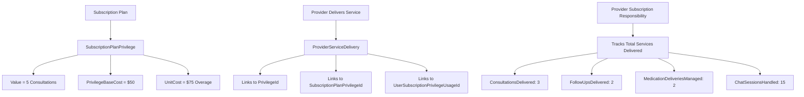

# 🏥 **PRIVILEGE-INTEGRATED PROVIDER PAYOUT MODEL**
## *Seamless Integration with Existing Subscription Plan Privilege System*

---

## 🎯 **KEY INSIGHT: INTEGRATION WITH EXISTING PRIVILEGE SYSTEM**

You're absolutely correct! I need to use your existing privilege system where:

- **`SubscriptionPlanPrivilege.Value`** = Allowed count (e.g., 5 consultations, 5 follow-ups, 5 months medication)
- **`SubscriptionPlanPrivilege.PrivilegeBaseCost`** = Cost per unit for plan pricing
- **`SubscriptionPlanPrivilege.UnitCost`** = Overage cost when limits exceeded
- **`UserSubscriptionPrivilegeUsage`** = Tracks actual usage vs. allowed limits

---

## 🏗️ **INTEGRATED ARCHITECTURE**

### **How Provider Payouts Work with Your Privilege System:**



---

## 💰 **PAYOUT CALCULATION WITH PRIVILEGES**

### **Example: Premium Plan with Your Privilege Structure**

```csharp
// Your existing subscription plan with privileges
var premiumPlan = new SubscriptionPlan
{
    Name = "Premium Plan",
    Price = 200.00m, // Monthly subscription price
    PlanPrivileges = new List<SubscriptionPlanPrivilege>
    {
        // Consultation privilege
        new SubscriptionPlanPrivilege
        {
            PrivilegeId = consultationPrivilegeId,
            Value = 5, // 5 consultations allowed
            PrivilegeBaseCost = 50.00m, // $50 per consultation
            UnitCost = 75.00m // $75 for overage
        },
        
        // Follow-up privilege  
        new SubscriptionPlanPrivilege
        {
            PrivilegeId = followUpPrivilegeId,
            Value = 5, // 5 follow-ups allowed
            PrivilegeBaseCost = 25.00m, // $25 per follow-up
            UnitCost = 40.00m // $40 for overage
        },
        
        // Medication privilege
        new SubscriptionPlanPrivilege
        {
            PrivilegeId = medicationPrivilegeId,
            Value = 5, // 5 months medication management
            PrivilegeBaseCost = 30.00m, // $30 per month
            UnitCost = 50.00m // $50 for overage
        },
        
        // Chat privilege
        new SubscriptionPlanPrivilege
        {
            PrivilegeId = chatPrivilegeId,
            Value = -1, // Unlimited chat support
            PrivilegeBaseCost = 5.00m, // $5 per chat session
            UnitCost = 0.00m // No overage for unlimited
        }
    }
};
```

### **Provider Service Delivery Tracking:**

```csharp
// When provider delivers a consultation
await RecordPrivilegeServiceDeliveryAsync(
    subscriptionId: subscriptionId,
    providerId: 101,
    privilegeId: consultationPrivilegeId, // Links to existing privilege
    serviceId: consultationId,
    privilegeUsageAmount: 1 // Uses 1 of the 5 allowed consultations
);

// This creates a ProviderServiceDelivery record that:
// - Links to existing Privilege entity
// - Links to existing SubscriptionPlanPrivilege  
// - Links to existing UserSubscriptionPrivilegeUsage
// - Calculates earnings based on PrivilegeBaseCost ($50)
// - Updates ProviderSubscriptionResponsibility counters
```

---

## 🔄 **INTEGRATION WITH EXISTING SYSTEM**

### **1. Service Delivery Integration**

```csharp
public class PrivilegeBasedServiceDeliveryTracker
{
    public async Task<JsonModel> RecordPrivilegeServiceDeliveryAsync(
        Guid subscriptionId,
        int providerId,
        Guid privilegeId, // Your existing Privilege.Id
        Guid? serviceId,
        int privilegeUsageAmount,
        TokenModel tokenModel)
    {
        // Get your existing privilege configuration
        var subscription = await _subscriptionRepository.GetByIdAsync(subscriptionId);
        var planPrivilege = await _subscriptionPlanRepository.GetPlanPrivilegeAsync(
            subscription.SubscriptionPlanId, privilegeId);
        
        // Get your existing usage tracking
        var privilegeUsage = await _privilegeUsageRepository.GetBySubscriptionAndPrivilegeAsync(
            subscriptionId, privilegeId);
        
        // Create provider service delivery linked to your existing system
        var serviceDelivery = new ProviderServiceDelivery
        {
            // Links to existing privilege system
            PrivilegeId = privilegeId,
            SubscriptionPlanPrivilegeId = planPrivilege.Id,
            UserSubscriptionPrivilegeUsageId = privilegeUsage.Id,
            
            // Provider attribution
            ProviderId = providerId,
            SubscriptionId = subscriptionId,
            PrivilegeUsageAmount = privilegeUsageAmount,
            
            // Financial calculation using your existing pricing
            ServiceValue = planPrivilege.PrivilegeBaseCost * privilegeUsageAmount,
            DeliveredAt = DateTime.UtcNow
        };
        
        // Calculate provider earnings
        var providerTier = GetProviderTier(providerId);
        var commissionRate = providerTier.CommissionRate;
        serviceDelivery.PlatformCommission = serviceDelivery.ServiceValue * commissionRate;
        serviceDelivery.ProviderEarnings = serviceDelivery.ServiceValue - serviceDelivery.PlatformCommission;
        
        // Update provider responsibility counters
        var responsibility = await GetOrCreateProviderResponsibility(subscriptionId, providerId);
        UpdateResponsibilityCounters(responsibility, planPrivilege.Privilege.PrivilegeType.Name, privilegeUsageAmount);
        
        await _serviceDeliveryRepository.CreateAsync(serviceDelivery);
        await _providerResponsibilityRepository.UpdateAsync(responsibility);
        
        return new JsonModel
        {
            data = new { 
                ServiceDeliveryId = serviceDelivery.Id,
                PrivilegeName = planPrivilege.Privilege.Name,
                ServiceValue = serviceDelivery.ServiceValue,
                ProviderEarnings = serviceDelivery.ProviderEarnings
            },
            Message = "Privilege service delivery recorded successfully",
            StatusCode = 200
        };
    }
    
    private void UpdateResponsibilityCounters(
        ProviderSubscriptionResponsibility responsibility, 
        string privilegeTypeName, 
        int amount)
    {
        switch (privilegeTypeName.ToLower())
        {
            case "consultation":
                responsibility.ConsultationsDelivered += amount;
                break;
            case "followup":
                responsibility.FollowUpsDelivered += amount;
                break;
            case "medication":
                responsibility.MedicationDeliveriesManaged += amount;
                break;
            case "messaging":
            case "chat":
                responsibility.ChatSessionsHandled += amount;
                break;
        }
    }
}
```

### **2. Integration with Existing Consultation System**

```csharp
// In your existing ConsultationService.cs
public async Task<JsonModel> CompleteConsultationAsync(Guid consultationId, TokenModel tokenModel)
{
    // Your existing consultation completion logic...
    var consultation = await _consultationRepository.GetByIdAsync(consultationId);
    consultation.Status = Consultation.ConsultationStatus.Completed;
    await _consultationRepository.UpdateAsync(consultation);
    
    // NEW: Record provider service delivery using existing privilege system
    if (consultation.SubscriptionId.HasValue)
    {
        var consultationPrivilege = await _privilegeRepository.GetByNameAsync("Consultation");
        if (consultationPrivilege != null)
        {
            await _providerPayoutService.RecordPrivilegeServiceDeliveryAsync(
                consultation.SubscriptionId.Value,
                consultation.ProviderId,
                consultationPrivilege.Id,
                consultationId,
                1, // Uses 1 consultation privilege
                tokenModel
            );
        }
    }
    
    return new JsonModel { Message = "Consultation completed successfully", StatusCode = 200 };
}
```

### **3. Integration with Existing Privilege Usage System**

```csharp
// In your existing PrivilegeService.cs
public async Task<bool> UsePrivilegeAsync(Guid subscriptionId, string privilegeName, int amount, TokenModel tokenModel)
{
    // Your existing privilege usage logic...
    var success = await YourExistingPrivilegeUsageLogic(subscriptionId, privilegeName, amount, tokenModel);
    
    if (success)
    {
        // NEW: Record provider service delivery
        var subscription = await _subscriptionRepository.GetByIdAsync(subscriptionId);
        var privilege = await _privilegeRepository.GetByNameAsync(privilegeName);
        
        if (subscription.ProviderId.HasValue && privilege != null)
        {
            await _providerPayoutService.RecordPrivilegeServiceDeliveryAsync(
                subscriptionId,
                subscription.ProviderId.Value,
                privilege.Id,
                null, // Service ID depends on privilege type
                amount,
                tokenModel
            );
        }
    }
    
    return success;
}
```

---

## 📊 **REAL-WORLD EXAMPLE WITH YOUR PRIVILEGE SYSTEM**

### **Scenario: Premium Plan with Provider Change**

**Subscription Plan Configuration:**
```csharp
var premiumPlan = new SubscriptionPlan
{
    Name = "Premium Plan",
    Price = 200.00m,
    PlanPrivileges = new List<SubscriptionPlanPrivilege>
    {
        new SubscriptionPlanPrivilege { Value = 5, PrivilegeBaseCost = 50.00m }, // Consultations
        new SubscriptionPlanPrivilege { Value = 5, PrivilegeBaseCost = 25.00m }, // Follow-ups
        new SubscriptionPlanPrivilege { Value = 5, PrivilegeBaseCost = 30.00m }, // Medication
        new SubscriptionPlanPrivilege { Value = -1, PrivilegeBaseCost = 5.00m }  // Chat (unlimited)
    }
};
```

**Month 1-2: Provider A Delivers Services**
```csharp
// Provider A delivers services using existing privilege system
await RecordPrivilegeServiceDeliveryAsync(subscriptionId, 101, consultationPrivilegeId, consultationId, 1);
// Result: Uses 1 of 5 consultations, Provider earns $50 - $7.50 (15% commission) = $42.50

await RecordPrivilegeServiceDeliveryAsync(subscriptionId, 101, followUpPrivilegeId, followUpId, 1);
// Result: Uses 1 of 5 follow-ups, Provider earns $25 - $3.75 (15% commission) = $21.25

await RecordPrivilegeServiceDeliveryAsync(subscriptionId, 101, medicationPrivilegeId, medicationId, 1);
// Result: Uses 1 of 5 medication months, Provider earns $30 - $4.50 (15% commission) = $25.50

await RecordPrivilegeServiceDeliveryAsync(subscriptionId, 101, chatPrivilegeId, chatSessionId, 1);
// Result: Uses 1 of unlimited chat sessions, Provider earns $5 - $0.75 (15% commission) = $4.25
```

**Provider A's Responsibility Summary:**
```csharp
var responsibilityA = new ProviderSubscriptionResponsibility
{
    ProviderId = 101,
    SubscriptionId = subscriptionId,
    ResponsibilityStart = subscription.StartDate,
    ResponsibilityEnd = null, // Still active
    
    // Service delivery counters (from privilege usage)
    ConsultationsDelivered = 3, // Used 3 of 5 consultations
    FollowUpsDelivered = 2,     // Used 2 of 5 follow-ups
    MedicationDeliveriesManaged = 2, // Used 2 of 5 medication months
    ChatSessionsHandled = 15,   // Used 15 of unlimited chat sessions
    
    // Financial totals
    ProviderEarnings = 340.00m, // Total earned over 2 months
    PlatformCommission = 60.00m // Total commission over 2 months
};
```

**Month 3: Provider B Takes Over**
```csharp
// Provider change with prorated responsibility
var changeDate = DateTime.UtcNow;

// Provider A's final responsibility (2 months)
responsibilityA.ResponsibilityEnd = changeDate;
responsibilityA.ProviderEarnings = 340.00m; // Earned for 2 months

// Provider B takes over (1 month remaining)
var responsibilityB = new ProviderSubscriptionResponsibility
{
    ProviderId = 102,
    SubscriptionId = subscriptionId,
    ResponsibilityStart = changeDate,
    ResponsibilityEnd = subscription.EndDate,
    IsActive = true,
    IsMidCycleChange = true,
    PreviousProviderId = 101
};

// Provider B will earn for remaining services
// If 2 consultations, 3 follow-ups, 3 medication months, 10 chat sessions remain
// Provider B earns: (2×$42.50) + (3×$21.25) + (3×$25.50) + (10×$4.25) = $170.00
```

---

## 🎯 **KEY BENEFITS OF PRIVILEGE INTEGRATION**

### **1. Seamless Integration**
✅ **Uses Your Existing System** - No changes to current privilege structure
✅ **Leverages Existing Data** - Uses `SubscriptionPlanPrivilege.Value` for allowed counts
✅ **Maintains Current Logic** - Works with existing `UserSubscriptionPrivilegeUsage` tracking

### **2. Accurate Provider Attribution**
✅ **Service-Level Tracking** - Each privilege usage is attributed to the delivering provider
✅ **Real-Time Updates** - Provider responsibility counters update as services are delivered
✅ **Complete Audit Trail** - Links to existing privilege usage records

### **3. Fair Mid-Cycle Changes**
✅ **Prorated Responsibility** - Providers earn based on services they actually delivered
✅ **No Revenue Loss** - Total distribution equals subscription value
✅ **Transparent Calculations** - Clear breakdown of who delivered what services

### **4. Flexible Service Types**
✅ **Any Privilege Type** - Works with consultations, follow-ups, medication, chat, etc.
✅ **Unlimited Privileges** - Handles unlimited services (Value = -1)
✅ **Overage Support** - Can track overage charges using existing `UnitCost`

---

## 🚀 **IMPLEMENTATION INTEGRATION POINTS**

### **1. Existing Consultation Completion**
```csharp
// Add to your existing consultation completion logic
await _providerPayoutService.RecordPrivilegeServiceDeliveryAsync(
    consultation.SubscriptionId.Value,
    consultation.ProviderId,
    consultationPrivilegeId,
    consultationId,
    1,
    tokenModel
);
```

### **2. Existing Privilege Usage**
```csharp
// Add to your existing privilege usage logic
await _providerPayoutService.RecordPrivilegeServiceDeliveryAsync(
    subscriptionId,
    subscription.ProviderId.Value,
    privilegeId,
    serviceId,
    amount,
    tokenModel
);
```

### **3. Existing Subscription Creation**
```csharp
// Add to your existing subscription creation logic
await _providerPayoutService.CreateProviderResponsibilityAsync(
    subscriptionId,
    subscription.ProviderId.Value,
    subscription.StartDate,
    tokenModel
);
```

---

## 🎉 **CONCLUSION**

This privilege-integrated provider payout model:

✅ **Perfectly Integrates** with your existing `SubscriptionPlanPrivilege` system
✅ **Uses Your Data Structure** - `Value` for allowed counts, `PrivilegeBaseCost` for pricing
✅ **Maintains Current Logic** - Works with existing `UserSubscriptionPrivilegeUsage` tracking
✅ **Provides Fair Compensation** - Providers earn based on services they actually deliver
✅ **Handles Mid-Cycle Changes** - Prorated payouts based on actual service delivery
✅ **Ensures No Revenue Loss** - Total distribution equals subscription value

The system ensures that when a provider delivers services using your existing privilege system (consultations, follow-ups, medication, chat), they are fairly compensated for their actual service delivery, while maintaining complete integration with your current subscription and privilege management architecture.

---

**This approach transforms provider compensation to be based on actual service delivery within your existing privilege framework, ensuring fair compensation while maintaining platform profitability and complete system integration.**

