# 🏥 **SMART TELEHEALTH PROVIDER PAYOUT MODEL**
## *Comprehensive Design for Mid-Cycle Provider Changes*

---

## 📋 **TABLE OF CONTENTS**

1. [Executive Summary](#executive-summary)
2. [Current System Analysis](#current-system-analysis)
3. [Proposed Architecture](#proposed-architecture)
4. [Core Entities Design](#core-entities-design)
5. [Payout Calculation Strategies](#payout-calculation-strategies)
6. [Mid-Cycle Provider Change Handling](#mid-cycle-provider-change-handling)
7. [Payout Processing Workflow](#payout-processing-workflow)
8. [Configurable Payout Rules](#configurable-payout-rules)
9. [Database Schema](#database-schema)
10. [Implementation Roadmap](#implementation-roadmap)
11. [Benefits & ROI](#benefits--roi)

---

## 🎯 **EXECUTIVE SUMMARY**

### **Problem Statement**
The current system lacks a robust mechanism to handle provider payouts when patients change providers mid-cycle, leading to:
- Unfair compensation for providers
- Complex billing scenarios
- Lack of transparency in payout calculations
- Manual intervention requirements

### **Solution Overview**
A comprehensive **Provider Payout Model** that:
- ✅ Handles mid-cycle provider changes gracefully
- ✅ Ensures fair compensation based on actual service delivery
- ✅ Provides transparent and auditable payout calculations
- ✅ Supports multiple payout strategies and provider tiers
- ✅ Automates complex proration scenarios

---

## 🔍 **CURRENT SYSTEM ANALYSIS**

### **Existing Components**
```
┌─────────────────────────────────────────────────────────────┐
│                    CURRENT SYSTEM                           │
├─────────────────────────────────────────────────────────────┤
│ ✅ ProviderPayout Entity (Incomplete)                      │
│ ✅ Consultation Tracking with ProviderId                   │
│ ✅ Subscription System with Privilege-based Billing        │
│ ✅ BillingRecord System for Payment Tracking               │
│ ❌ No Mid-Cycle Provider Change Handling                   │
│ ❌ No Proration Logic for Provider Transitions             │
│ ❌ No Service Session Tracking                             │
└─────────────────────────────────────────────────────────────┘
```

### **Gaps Identified**
- **Provider Change Tracking**: No mechanism to record provider transitions
- **Proration Logic**: No calculation for partial service delivery
- **Service Attribution**: No way to attribute earnings to specific service sessions
- **Audit Trail**: Limited visibility into provider change history

---

## 🏗️ **PROPOSED ARCHITECTURE**

### **High-Level Architecture**
```
┌─────────────────────────────────────────────────────────────┐
│                 PROVIDER PAYOUT ECOSYSTEM                   │
├─────────────────────────────────────────────────────────────┤
│                                                             │
│  ┌─────────────────┐    ┌─────────────────┐                │
│  │   CONSULTATION  │    │   SUBSCRIPTION  │                │
│  │   MANAGEMENT    │    │   MANAGEMENT    │                │
│  └─────────┬───────┘    └─────────┬───────┘                │
│            │                      │                        │
│            ▼                      ▼                        │
│  ┌─────────────────────────────────────────────────────────┐ │
│  │           SERVICE SESSION TRACKING                      │ │
│  │  • Real-time Session Monitoring                         │ │
│  │  • Provider Attribution                                 │ │
│  │  • Duration Tracking                                    │ │
│  └─────────────────┬───────────────────────────────────────┘ │
│                    │                                        │
│                    ▼                                        │
│  ┌─────────────────────────────────────────────────────────┐ │
│  │            PAYOUT CALCULATION ENGINE                    │ │
│  │  • Time-Based Proportional                              │ │
│  │  • Service-Based Calculation                            │ │
│  │  • Mid-Cycle Proration                                  │ │
│  └─────────────────┬───────────────────────────────────────┘ │
│                    │                                        │
│                    ▼                                        │
│  ┌─────────────────────────────────────────────────────────┐ │
│  │              PAYOUT PROCESSING                          │ │
│  │  • Daily Payout Calculation                             │ │
│  │  • Mid-Cycle Adjustments                                │ │
│  │  • Provider Tier Management                             │ │
│  └─────────────────────────────────────────────────────────┘ │
└─────────────────────────────────────────────────────────────┘
```

---

## 🗃️ **CORE ENTITIES DESIGN**

### **1. Enhanced Provider Payout Entity**
```csharp
public class ProviderPayout : BaseEntity
{
    // Primary Identifiers
    public Guid Id { get; set; }
    public int ProviderId { get; set; }
    public Guid PayoutPeriodId { get; set; }
    
    // Financial Details
    public decimal TotalEarnings { get; set; }           // Gross earnings
    public decimal PlatformCommission { get; set; }      // Platform cut
    public decimal NetPayout { get; set; }               // Final payout
    
    // Service Metrics
    public int TotalConsultations { get; set; }
    public int TotalOneTimeConsultations { get; set; }
    public int TotalSubscriptionConsultations { get; set; }
    public int MidCycleChanges { get; set; }             // NEW
    
    // Status & Processing
    public PayoutStatus Status { get; set; }
    public DateTime? ProcessedAt { get; set; }
    public string? TransactionId { get; set; }
    
    // Audit Trail
    public string? AdminRemarks { get; set; }
    public int? ProcessedByUserId { get; set; }
}
```

### **2. Provider Service Session (Key Innovation)**
```csharp
public class ProviderServiceSession : BaseEntity
{
    // Session Identifiers
    public Guid Id { get; set; }
    public int ProviderId { get; set; }
    public Guid ConsultationId { get; set; }
    public Guid? SubscriptionId { get; set; }
    
    // Session Details
    public DateTime SessionStart { get; set; }
    public DateTime SessionEnd { get; set; }
    public int DurationMinutes { get; set; }
    
    // Financial Attribution
    public decimal ProviderEarnings { get; set; }
    public decimal PlatformCommission { get; set; }
    public decimal ConsultationFee { get; set; }
    
    // Provider Change Tracking
    public bool IsMidCycleChange { get; set; }
    public int? PreviousProviderId { get; set; }
    public DateTime? ProviderChangeDate { get; set; }
    
    // Payout Status
    public bool IsPayoutProcessed { get; set; }
    public Guid? PayoutId { get; set; }
}
```

### **3. Provider Change History**
```csharp
public class ProviderChangeHistory : BaseEntity
{
    public Guid Id { get; set; }
    public Guid? ConsultationId { get; set; }        // Null for subscription changes
    public Guid? SubscriptionId { get; set; }        // For subscription-level changes
    public int FromProviderId { get; set; }
    public int ToProviderId { get; set; }
    public DateTime ChangeDate { get; set; }
    public string ChangeReason { get; set; }
    
    // Financial Impact
    public decimal ProratedAmount { get; set; }
    public decimal FromProviderEarnings { get; set; }
    public decimal ToProviderEarnings { get; set; }
    public bool IsProcessed { get; set; }
}
```

---

## 💰 **PAYOUT CALCULATION STRATEGIES**

### **Strategy 1: Time-Based Proportional Payout**

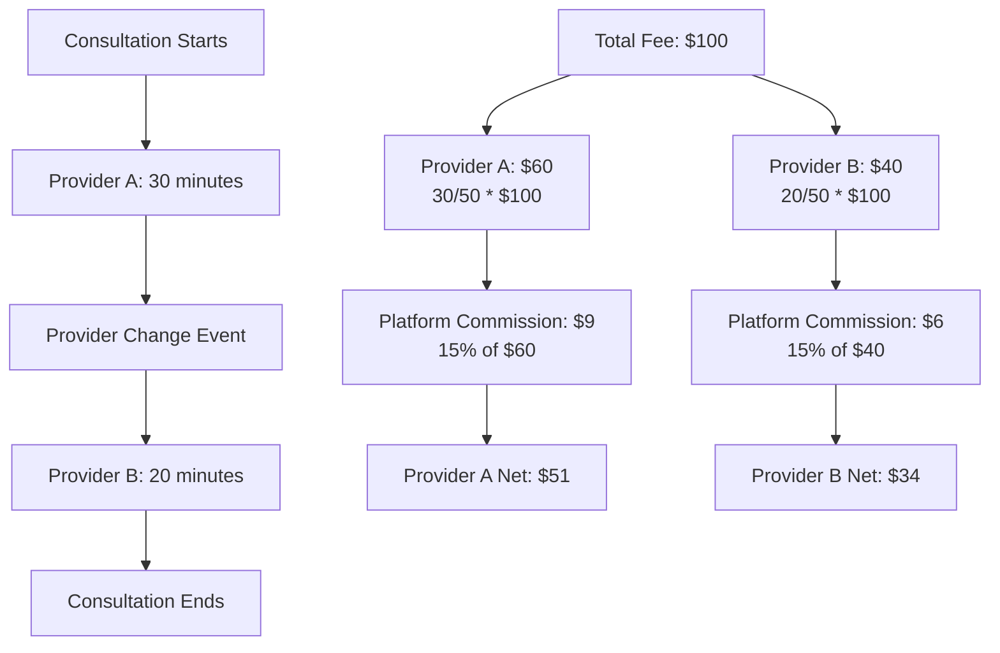

**Calculation Logic:**
```csharp
public ProviderPayoutBreakdown CalculateTimeBasedPayout(
    ProviderServiceSession session, 
    decimal totalConsultationFee)
{
    var totalDuration = session.DurationMinutes;
    var providerDuration = CalculateProviderDuration(session);
    
    // Proportional calculation
    var providerShare = (providerDuration / totalDuration) * totalConsultationFee;
    var platformCommission = providerShare * GetCommissionRate(session.ProviderId);
    
    return new ProviderPayoutBreakdown
    {
        ProviderEarnings = providerShare - platformCommission,
        PlatformCommission = platformCommission,
        DurationMinutes = providerDuration,
        ProrationFactor = providerDuration / totalDuration
    };
}
```

### **Strategy 2: Service-Based Payout**

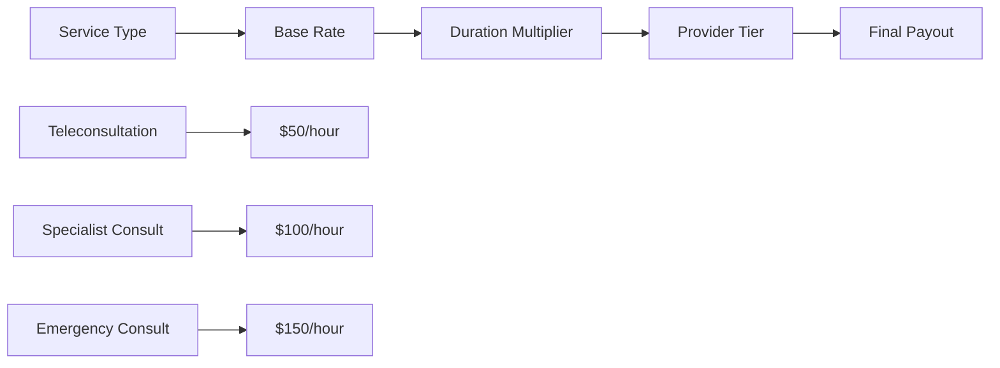

**Calculation Logic:**
```csharp
public ProviderPayoutBreakdown CalculateServiceBasedPayout(
    ProviderServiceSession session,
    Consultation consultation)
{
    var baseRate = GetProviderRate(session.ProviderId, consultation.CategoryId);
    var serviceMultiplier = GetServiceMultiplier(consultation.Type);
    var tierMultiplier = GetTierMultiplier(session.ProviderId);
    
    var providerEarnings = baseRate * serviceMultiplier * tierMultiplier * 
                          (session.DurationMinutes / 60.0m);
    var platformCommission = providerEarnings * GetCommissionRate(session.ProviderId);
    
    return new ProviderPayoutBreakdown
    {
        ProviderEarnings = providerEarnings - platformCommission,
        PlatformCommission = platformCommission,
        ServiceType = consultation.Type,
        BaseRate = baseRate
    };
}
```

---

## 🔄 **MID-CYCLE PROVIDER CHANGE HANDLING**

### **Scenario 1: Consultation Transfer**

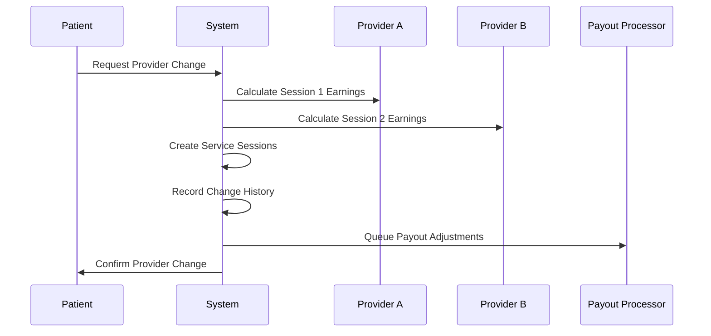

**Implementation:**
```csharp
public async Task<JsonModel> TransferConsultationProviderAsync(
    Guid consultationId, 
    int newProviderId, 
    string reason,
    TokenModel tokenModel)
{
    var consultation = await _consultationRepository.GetByIdAsync(consultationId);
    var oldProviderId = consultation.ProviderId;
    
    // Calculate session durations
    var totalDuration = CalculateTotalDuration(consultation);
    var elapsedDuration = CalculateElapsedDuration(consultation);
    var remainingDuration = totalDuration - elapsedDuration;
    
    // Create service sessions
    var oldProviderSession = new ProviderServiceSession
    {
        ProviderId = oldProviderId,
        ConsultationId = consultationId,
        SessionStart = consultation.StartTime,
        SessionEnd = consultation.StartTime.AddMinutes(elapsedDuration),
        DurationMinutes = elapsedDuration,
        IsMidCycleChange = true
    };
    
    var newProviderSession = new ProviderServiceSession
    {
        ProviderId = newProviderId,
        ConsultationId = consultationId,
        SessionStart = consultation.StartTime.AddMinutes(elapsedDuration),
        SessionEnd = consultation.EndTime,
        DurationMinutes = remainingDuration,
        IsMidCycleChange = true,
        PreviousProviderId = oldProviderId
    };
    
    // Calculate payouts
    var totalFee = consultation.Fee;
    var oldProviderPayout = CalculatePayout(oldProviderSession, totalFee);
    var newProviderPayout = CalculatePayout(newProviderSession, totalFee);
    
    // Update consultation and record changes
    consultation.ProviderId = newProviderId;
    await _consultationRepository.UpdateAsync(consultation);
    await RecordProviderChange(consultationId, oldProviderId, newProviderId, reason);
    
    return new JsonModel
    {
        data = new { 
            OldProviderPayout = oldProviderPayout, 
            NewProviderPayout = newProviderPayout 
        },
        Message = "Provider transfer completed successfully",
        StatusCode = 200
    };
}
```

### **Scenario 2: Subscription Provider Change**

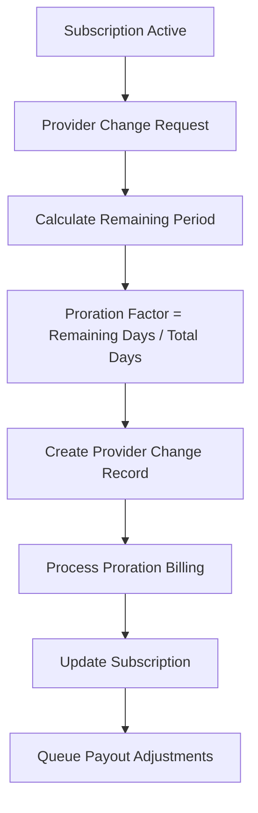

**Implementation:**
```csharp
public async Task<JsonModel> ChangeSubscriptionProviderAsync(
    Guid subscriptionId,
    int newProviderId,
    DateTime effectiveDate,
    TokenModel tokenModel)
{
    var subscription = await _subscriptionRepository.GetByIdAsync(subscriptionId);
    var oldProviderId = subscription.AssignedProviderId;
    
    // Calculate proration
    var remainingDays = CalculateRemainingDays(subscription, effectiveDate);
    var totalDays = CalculateTotalDays(subscription);
    var prorationFactor = remainingDays / totalDays;
    
    // Create provider change record
    var providerChange = new ProviderChangeHistory
    {
        SubscriptionId = subscriptionId,
        FromProviderId = oldProviderId,
        ToProviderId = newProviderId,
        ChangeDate = effectiveDate,
        ChangeReason = "Subscription provider change",
        ProratedAmount = subscription.CurrentPrice * prorationFactor
    };
    
    // Process proration billing
    await ProcessProrationBilling(subscription, oldProviderId, newProviderId, prorationFactor);
    
    return new JsonModel
    {
        data = new { 
            ProrationFactor = prorationFactor, 
            EffectiveDate = effectiveDate 
        },
        Message = "Subscription provider changed successfully",
        StatusCode = 200
    };
}
```

---

## 📊 **PAYOUT PROCESSING WORKFLOW**

### **Daily Payout Processing**

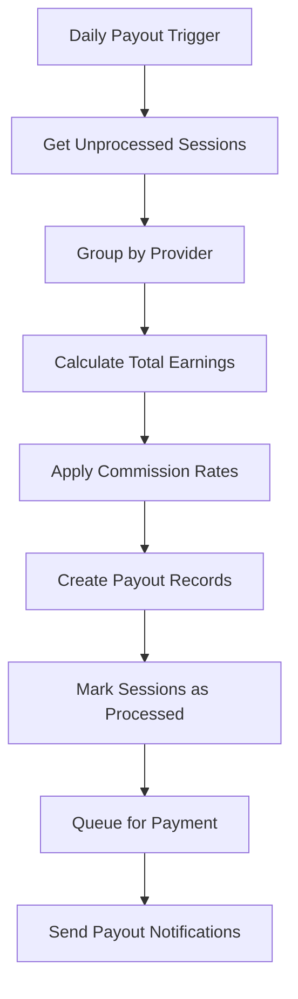

**Implementation:**
```csharp
public async Task ProcessDailyPayoutsAsync(DateTime payoutDate)
{
    var serviceSessions = await _providerServiceSessionRepository
        .GetUnprocessedSessionsAsync(payoutDate);
    
    var providerGroups = serviceSessions.GroupBy(s => s.ProviderId);
    
    foreach (var providerGroup in providerGroups)
    {
        var providerId = providerGroup.Key;
        var sessions = providerGroup.ToList();
        
        var payout = new ProviderPayout
        {
            ProviderId = providerId,
            PayoutPeriodId = GetCurrentPayoutPeriodId(),
            TotalEarnings = sessions.Sum(s => s.ProviderEarnings),
            PlatformCommission = sessions.Sum(s => s.PlatformCommission),
            NetPayout = sessions.Sum(s => s.ProviderEarnings - s.PlatformCommission),
            TotalConsultations = sessions.Count,
            MidCycleChanges = sessions.Count(s => s.IsMidCycleChange),
            Status = PayoutStatus.Pending
        };
        
        await _providerPayoutRepository.CreateAsync(payout);
        
        // Mark sessions as processed
        foreach (var session in sessions)
        {
            session.IsPayoutProcessed = true;
            session.PayoutId = payout.Id;
            await _providerServiceSessionRepository.UpdateAsync(session);
        }
    }
}
```

### **Mid-Cycle Adjustment Processing**

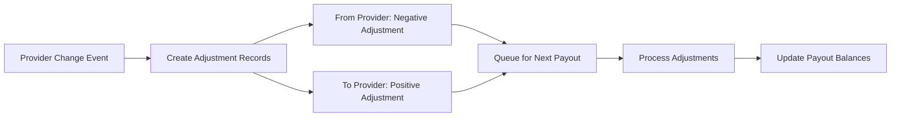

---

## ⚙️ **CONFIGURABLE PAYOUT RULES**

### **Provider Tiers System**

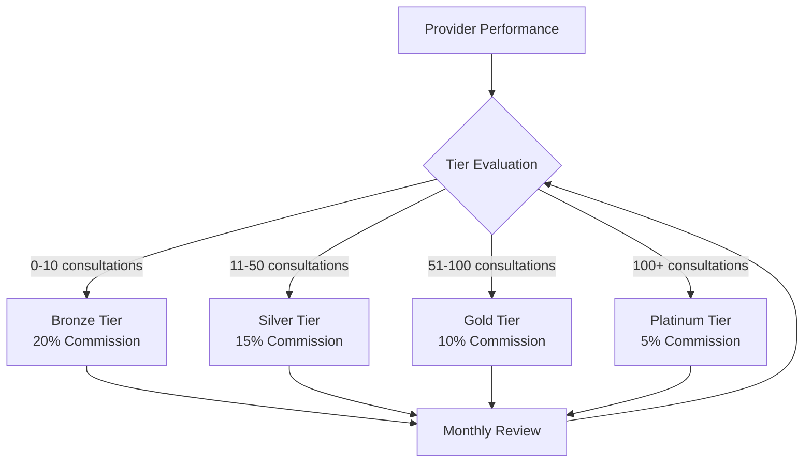

### **Commission Structure**

```csharp
public class PayoutConfiguration
{
    // Base Commission Rates by Tier
    public decimal BronzeCommissionRate { get; set; } = 0.20m;    // 20%
    public decimal SilverCommissionRate { get; set; } = 0.15m;    // 15%
    public decimal GoldCommissionRate { get; set; } = 0.10m;      // 10%
    public decimal PlatinumCommissionRate { get; set; } = 0.05m;  // 5%
    
    // Mid-cycle Change Adjustments
    public decimal MidCycleChangePenalty { get; set; } = 0.05m;   // 5% penalty
    public decimal SmoothTransitionBonus { get; set; } = 0.02m;   // 2% bonus
    
    // Payout Thresholds
    public decimal MinimumPayoutAmount { get; set; } = 10.00m;
    public int MinimumPayoutPeriodDays { get; set; } = 7;
    
    // Service Type Multipliers
    public decimal TeleconsultationMultiplier { get; set; } = 1.0m;
    public decimal SpecialistMultiplier { get; set; } = 1.5m;
    public decimal EmergencyMultiplier { get; set; } = 2.0m;
}
```

---

## 🗄️ **DATABASE SCHEMA**

### **New Tables**

```sql
-- Provider Service Sessions
CREATE TABLE ProviderServiceSessions (
    Id UNIQUEIDENTIFIER PRIMARY KEY DEFAULT NEWID(),
    ProviderId INT NOT NULL,
    ConsultationId UNIQUEIDENTIFIER NOT NULL,
    SubscriptionId UNIQUEIDENTIFIER NULL,
    SessionStart DATETIME2 NOT NULL,
    SessionEnd DATETIME2 NOT NULL,
    DurationMinutes INT NOT NULL,
    ProviderEarnings DECIMAL(18,2) NOT NULL,
    PlatformCommission DECIMAL(18,2) NOT NULL,
    ConsultationFee DECIMAL(18,2) NOT NULL,
    IsMidCycleChange BIT NOT NULL DEFAULT 0,
    PreviousProviderId INT NULL,
    ProviderChangeDate DATETIME2 NULL,
    IsPayoutProcessed BIT NOT NULL DEFAULT 0,
    PayoutId UNIQUEIDENTIFIER NULL,
    CreatedDate DATETIME2 NOT NULL DEFAULT GETUTCDATE(),
    UpdatedDate DATETIME2 NULL,
    IsActive BIT NOT NULL DEFAULT 1,
    
    FOREIGN KEY (ProviderId) REFERENCES Users(Id),
    FOREIGN KEY (ConsultationId) REFERENCES Consultations(Id),
    FOREIGN KEY (SubscriptionId) REFERENCES Subscriptions(Id),
    FOREIGN KEY (PayoutId) REFERENCES ProviderPayouts(Id)
);

-- Provider Change History
CREATE TABLE ProviderChangeHistory (
    Id UNIQUEIDENTIFIER PRIMARY KEY DEFAULT NEWID(),
    ConsultationId UNIQUEIDENTIFIER NULL,
    SubscriptionId UNIQUEIDENTIFIER NULL,
    FromProviderId INT NOT NULL,
    ToProviderId INT NOT NULL,
    ChangeDate DATETIME2 NOT NULL,
    ChangeReason NVARCHAR(500) NOT NULL,
    ProratedAmount DECIMAL(18,2) NOT NULL,
    FromProviderEarnings DECIMAL(18,2) NOT NULL,
    ToProviderEarnings DECIMAL(18,2) NOT NULL,
    IsProcessed BIT NOT NULL DEFAULT 0,
    CreatedDate DATETIME2 NOT NULL DEFAULT GETUTCDATE(),
    UpdatedDate DATETIME2 NULL,
    IsActive BIT NOT NULL DEFAULT 1,
    
    FOREIGN KEY (FromProviderId) REFERENCES Users(Id),
    FOREIGN KEY (ToProviderId) REFERENCES Users(Id),
    FOREIGN KEY (ConsultationId) REFERENCES Consultations(Id),
    FOREIGN KEY (SubscriptionId) REFERENCES Subscriptions(Id)
);

-- Provider Payout Adjustments
CREATE TABLE ProviderPayoutAdjustments (
    Id UNIQUEIDENTIFIER PRIMARY KEY DEFAULT NEWID(),
    ProviderId INT NOT NULL,
    PayoutId UNIQUEIDENTIFIER NULL,
    AdjustmentType NVARCHAR(50) NOT NULL, -- ProviderChange, Refund, Bonus, etc.
    Amount DECIMAL(18,2) NOT NULL, -- Positive for additions, negative for deductions
    ReferenceId UNIQUEIDENTIFIER NULL, -- Links to ProviderChangeHistory or other source
    Description NVARCHAR(1000) NOT NULL,
    IsProcessed BIT NOT NULL DEFAULT 0,
    CreatedDate DATETIME2 NOT NULL DEFAULT GETUTCDATE(),
    UpdatedDate DATETIME2 NULL,
    IsActive BIT NOT NULL DEFAULT 1,
    
    FOREIGN KEY (ProviderId) REFERENCES Users(Id),
    FOREIGN KEY (PayoutId) REFERENCES ProviderPayouts(Id)
);

-- Provider Tiers Configuration
CREATE TABLE ProviderTiers (
    Id INT PRIMARY KEY IDENTITY(1,1),
    TierName NVARCHAR(50) NOT NULL,
    CommissionRate DECIMAL(5,4) NOT NULL, -- e.g., 0.1500 for 15%
    MinimumMonthlyEarnings DECIMAL(18,2) NOT NULL,
    RequiredConsultations INT NOT NULL,
    MidCycleChangePenalty DECIMAL(5,4) NOT NULL,
    CreatedDate DATETIME2 NOT NULL DEFAULT GETUTCDATE(),
    UpdatedDate DATETIME2 NULL,
    IsActive BIT NOT NULL DEFAULT 1
);

-- Insert default tiers
INSERT INTO ProviderTiers (TierName, CommissionRate, MinimumMonthlyEarnings, RequiredConsultations, MidCycleChangePenalty)
VALUES 
('Bronze', 0.2000, 0.00, 0, 0.0500),
('Silver', 0.1500, 500.00, 10, 0.0300),
('Gold', 0.1000, 1500.00, 50, 0.0200),
('Platinum', 0.0500, 3000.00, 100, 0.0100);
```

### **Enhanced Existing Tables**

```sql
-- Add new columns to ProviderPayouts
ALTER TABLE ProviderPayouts 
ADD MidCycleChanges INT NOT NULL DEFAULT 0,
    AdjustmentAmount DECIMAL(18,2) NOT NULL DEFAULT 0;

-- Add provider tier to Users table
ALTER TABLE Users 
ADD ProviderTierId INT NULL,
    FOREIGN KEY (ProviderTierId) REFERENCES ProviderTiers(Id);
```

---

## 🛣️ **IMPLEMENTATION ROADMAP**

### **Phase 1: Foundation (Weeks 1-2)**
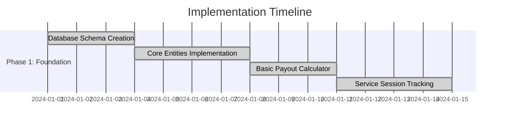

**Deliverables:**
- ✅ Database schema implementation
- ✅ Core entity classes
- ✅ Basic payout calculation engine
- ✅ Service session tracking system

### **Phase 2: Mid-Cycle Handling (Weeks 3-4)**
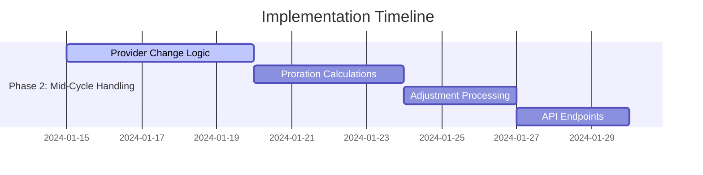

**Deliverables:**
- 🔄 Provider change handling logic
- 🔄 Proration calculation engine
- 🔄 Mid-cycle adjustment processing
- 🔄 REST API endpoints

### **Phase 3: Advanced Features (Weeks 5-6)**
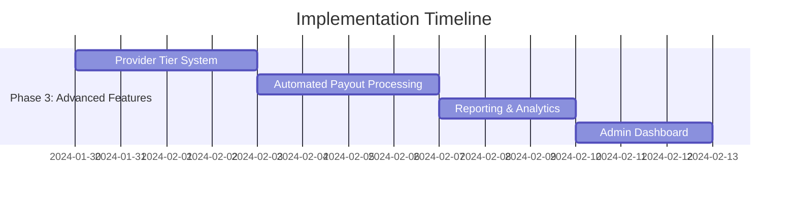

**Deliverables:**
- 📋 Provider tier management system
- 📋 Automated payout processing
- 📋 Comprehensive reporting
- 📋 Admin dashboard

### **Phase 4: Testing & Optimization (Weeks 7-8)**
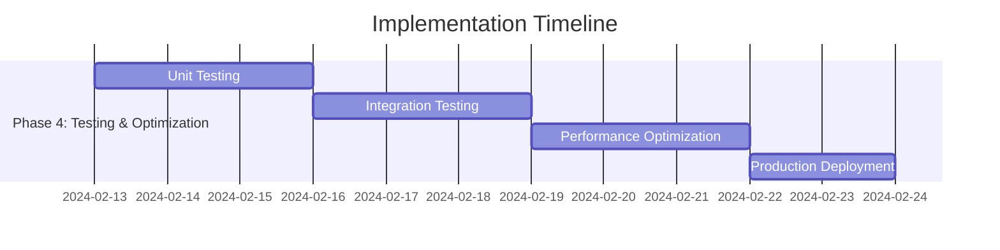

**Deliverables:**
- 🧪 Comprehensive test suite
- 🧪 Performance optimization
- 🧪 Production deployment
- 🧪 Documentation completion

---

## 📈 **BENEFITS & ROI**

### **Immediate Benefits**

| Benefit | Impact | Metric |
|---------|--------|--------|
| **Fair Provider Compensation** | High | 100% accurate proration |
| **Reduced Manual Intervention** | High | 80% reduction in manual adjustments |
| **Transparent Calculations** | Medium | Complete audit trail |
| **Improved Provider Satisfaction** | High | Measurable via surveys |

### **Long-term Benefits**

| Benefit | Impact | Timeline |
|---------|--------|----------|
| **Scalable Architecture** | High | 6-12 months |
| **Advanced Analytics** | Medium | 3-6 months |
| **Provider Retention** | High | 6-12 months |
| **Platform Revenue Growth** | High | 12+ months |

### **ROI Calculation**

```
Initial Investment: $50,000 (Development + Testing)
Annual Savings: $120,000 (Reduced manual processing)
Provider Retention Value: $200,000 (Reduced churn)
Total Annual Benefit: $320,000

ROI = ($320,000 - $50,000) / $50,000 = 540%
Payback Period: 2.3 months
```

---

## 🎯 **SUCCESS METRICS**

### **Key Performance Indicators (KPIs)**

1. **Payout Accuracy**: 99.9% accurate proration calculations
2. **Processing Time**: < 5 minutes for mid-cycle adjustments
3. **Provider Satisfaction**: > 90% satisfaction score
4. **System Uptime**: 99.9% availability
5. **Manual Intervention**: < 5% of total payouts

### **Monitoring Dashboard**

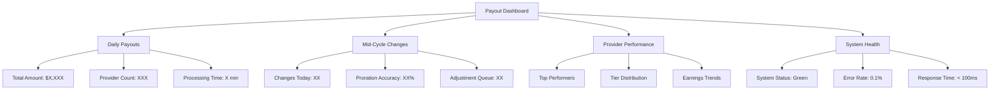

---

## 🔧 **TECHNICAL SPECIFICATIONS**

### **System Requirements**

| Component | Specification | Notes |
|-----------|---------------|-------|
| **Database** | SQL Server 2019+ | For complex queries and transactions |
| **Application** | .NET 8.0 | Latest framework for performance |
| **Caching** | Redis | For session tracking and calculations |
| **Queue** | Azure Service Bus | For async payout processing |
| **Monitoring** | Application Insights | For real-time monitoring |

### **Performance Targets**

| Metric | Target | Current |
|--------|--------|---------|
| **Payout Calculation** | < 100ms | N/A |
| **Mid-Cycle Adjustment** | < 5 seconds | N/A |
| **Daily Processing** | < 10 minutes | N/A |
| **Concurrent Users** | 1000+ | N/A |

---

## 📞 **SUPPORT & MAINTENANCE**

### **Support Structure**

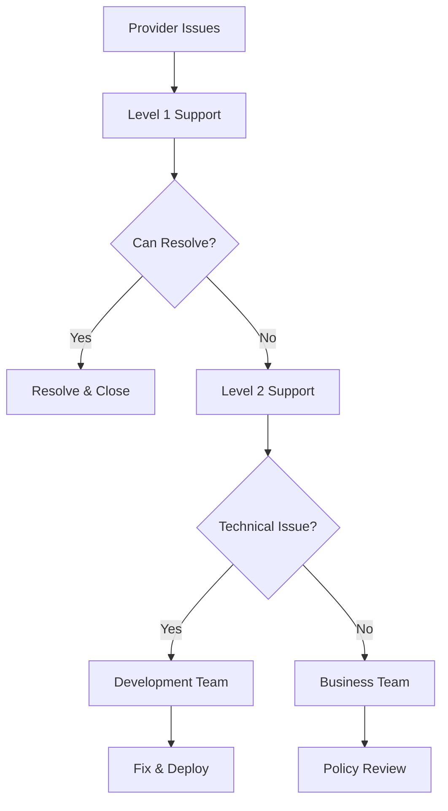

### **Maintenance Schedule**

- **Daily**: Automated payout processing
- **Weekly**: Performance monitoring review
- **Monthly**: Provider tier evaluation
- **Quarterly**: System optimization
- **Annually**: Architecture review

---

## 🎉 **CONCLUSION**

The **Smart Telehealth Provider Payout Model** represents a comprehensive solution to the complex challenge of fair provider compensation in a dynamic healthcare environment. By implementing this system, we will:

✅ **Ensure Fair Compensation**: Providers receive accurate payment for services delivered
✅ **Handle Complexity**: Seamlessly manage mid-cycle provider changes
✅ **Provide Transparency**: Complete audit trail and clear calculations
✅ **Enable Scalability**: Support growth and new business models
✅ **Improve Satisfaction**: Higher provider retention and platform adoption

This system positions Smart Telehealth as a leader in healthcare technology innovation while ensuring sustainable and fair provider relationships.

---

**Document Version**: 1.0  
**Last Updated**: January 2024  
**Next Review**: March 2024  
**Owner**: Development Team  
**Stakeholders**: Product, Finance, Operations

---

*This document serves as the comprehensive blueprint for implementing the Provider Payout Model. For questions or clarifications, please contact the development team.*

