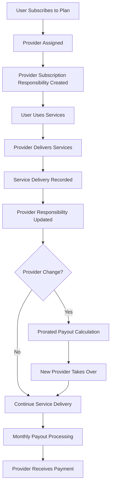
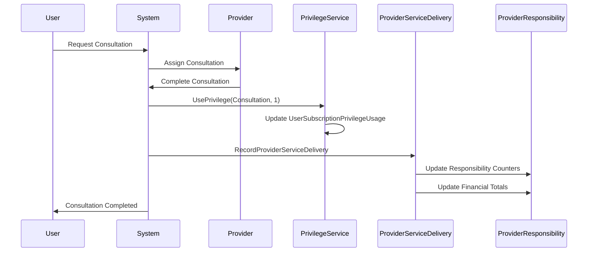
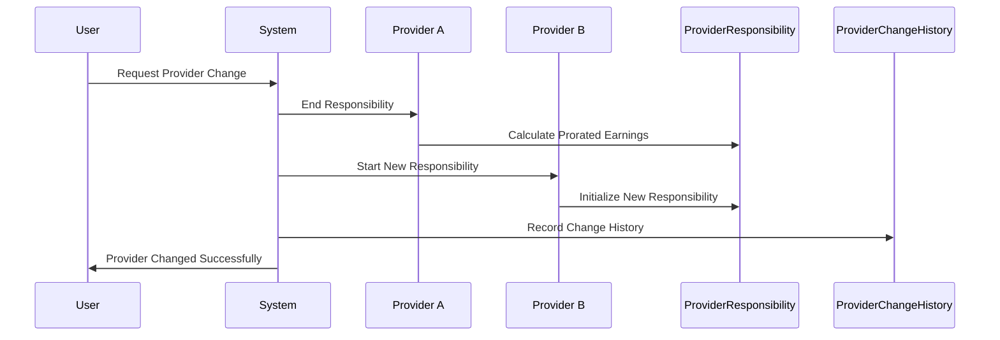
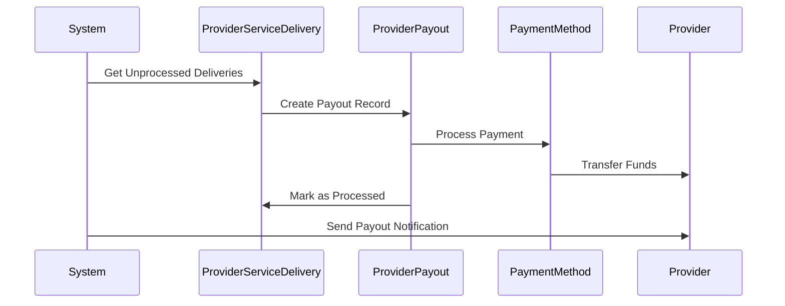

# 🏥 **PROVIDER PAYOUT SYSTEM - COMPLETE WORKING FLOW**
## *Code-Level Implementation with Visual Diagrams*

---

## 🎯 **SYSTEM OVERVIEW**

This document provides a complete working flow showing how the provider payout system integrates with your existing privilege system, including code examples and visual diagrams.

---

## 📊 **HIGH-LEVEL SYSTEM FLOW**



---

## 🏗️ **DETAILED WORKING FLOW**

### **Phase 1: Subscription Creation & Provider Assignment**

#### **1.1 User Subscribes to Premium Plan**
```csharp
// User subscribes to Premium Plan ($200/month)
var subscription = new Subscription
{
    Id = Guid.NewGuid(),
    UserId = 1001,
    SubscriptionPlanId = premiumPlanId,
    ProviderId = 101, // Provider A assigned
    StartDate = DateTime.UtcNow,
    EndDate = DateTime.UtcNow.AddMonths(3),
    Status = "Active",
    CurrentPrice = 200.00m
};

await _subscriptionRepository.CreateAsync(subscription);
```

#### **1.2 Create Provider Subscription Responsibility**
```csharp
// Create provider responsibility record
var providerResponsibility = new ProviderSubscriptionResponsibility
{
    Id = Guid.NewGuid(),
    ProviderId = 101, // Provider A
    SubscriptionId = subscription.Id,
    ResponsibilityStart = subscription.StartDate,
    ResponsibilityEnd = null, // Still active
    IsActive = true,
    
    // Initialize counters
    ConsultationsDelivered = 0,
    FollowUpsDelivered = 0,
    MedicationDeliveriesManaged = 0,
    ChatSessionsHandled = 0,
    
    // Financial tracking
    SubscriptionPlanValue = subscription.CurrentPrice,
    ProviderEarnings = 0,
    PlatformCommission = 0,
    CommissionRate = 0.15m // 15% commission
};

await _providerResponsibilityRepository.CreateAsync(providerResponsibility);
```

#### **1.3 Initialize Privilege Usage Records**
```csharp
// Create privilege usage records for the subscription
var consultationPrivilege = await _privilegeRepository.GetByNameAsync("Consultation");
var medicationPrivilege = await _privilegeRepository.GetByNameAsync("Medication Management");
var chatPrivilege = await _privilegeRepository.GetByNameAsync("Chat Support");

// Initialize usage tracking
var consultationUsage = new UserSubscriptionPrivilegeUsage
{
    SubscriptionId = subscription.Id,
    SubscriptionPlanPrivilegeId = consultationPlanPrivilege.Id,
    PrivilegeId = consultationPrivilege.Id,
    UsedValue = 0,
    AllowedValue = 5, // 5 consultations allowed
    UsagePeriodStart = subscription.StartDate,
    UsagePeriodEnd = subscription.EndDate
};

await _privilegeUsageRepository.CreateAsync(consultationUsage);
```

---

### **Phase 2: Service Delivery & Tracking**

#### **2.1 User Requests Consultation**
```csharp
// User requests a consultation
var consultation = new Consultation
{
    Id = Guid.NewGuid(),
    UserId = 1001,
    ProviderId = 101, // Provider A
    SubscriptionId = subscription.Id,
    Status = Consultation.ConsultationStatus.Scheduled,
    ScheduledAt = DateTime.UtcNow.AddHours(1),
    Fee = 50.00m
};

await _consultationRepository.CreateAsync(consultation);
```

#### **2.2 Provider Delivers Consultation**
```csharp
// Provider A delivers the consultation
public async Task<JsonModel> CompleteConsultationAsync(Guid consultationId, TokenModel tokenModel)
{
    var consultation = await _consultationRepository.GetByIdAsync(consultationId);
    
    // Mark consultation as completed
    consultation.Status = Consultation.ConsultationStatus.Completed;
    consultation.StartTime = DateTime.UtcNow.AddHours(-1);
    consultation.EndTime = DateTime.UtcNow;
    await _consultationRepository.UpdateAsync(consultation);
    
    // Record privilege usage in existing system
    await _privilegeService.UsePrivilegeAsync(
        consultation.SubscriptionId.Value, 
        "Consultation", 
        1, // Uses 1 consultation
        tokenModel
    );
    
    // NEW: Record provider service delivery
    await RecordProviderServiceDeliveryAsync(
        consultation.SubscriptionId.Value,
        consultation.ProviderId,
        consultationPrivilegeId,
        consultationId,
        1, // Provider delivered 1 consultation
        tokenModel
    );
    
    return new JsonModel { Message = "Consultation completed successfully", StatusCode = 200 };
}
```

#### **2.3 Record Provider Service Delivery**
```csharp
public async Task<JsonModel> RecordProviderServiceDeliveryAsync(
    Guid subscriptionId,
    int providerId,
    Guid privilegeId,
    Guid? serviceId,
    int privilegeUsageAmount,
    TokenModel tokenModel)
{
    // Get existing privilege configuration
    var subscription = await _subscriptionRepository.GetByIdAsync(subscriptionId);
    var planPrivilege = await _subscriptionPlanRepository.GetPlanPrivilegeAsync(
        subscription.SubscriptionPlanId, privilegeId);
    var privilegeUsage = await _privilegeUsageRepository.GetBySubscriptionAndPrivilegeAsync(
        subscriptionId, privilegeId);
    
    // Get provider responsibility
    var responsibility = await _providerResponsibilityRepository
        .GetActiveBySubscriptionAndProviderAsync(subscriptionId, providerId);
    
    // Create service delivery record
    var serviceDelivery = new ProviderServiceDelivery
    {
        Id = Guid.NewGuid(),
        ProviderSubscriptionResponsibilityId = responsibility.Id,
        ProviderId = providerId,
        SubscriptionId = subscriptionId,
        PrivilegeId = privilegeId,
        SubscriptionPlanPrivilegeId = planPrivilege.Id,
        UserSubscriptionPrivilegeUsageId = privilegeUsage.Id,
        PrivilegeUsageAmount = privilegeUsageAmount,
        DeliveredAt = DateTime.UtcNow,
        ServiceValue = planPrivilege.PrivilegeBaseCost * privilegeUsageAmount
    };
    
    // ✅ CORRECTED: Provider gets full privilege cost (no commission deduction)
    // Commission is already collected from user's subscription payment
    serviceDelivery.ProviderEarnings = serviceDelivery.ServiceValue; // Full amount
    serviceDelivery.PlatformCommission = 0; // Commission already collected from user
    
    // Update responsibility counters
    UpdateResponsibilityCounters(responsibility, planPrivilege.Privilege.PrivilegeType.Name, privilegeUsageAmount);
    
    // Update financial totals
    responsibility.ProviderEarnings += serviceDelivery.ProviderEarnings;
    // Platform commission is already collected from user's subscription payment
    
    // Save records
    await _serviceDeliveryRepository.CreateAsync(serviceDelivery);
    await _providerResponsibilityRepository.UpdateAsync(responsibility);
    
    return new JsonModel
    {
        data = new { 
            ServiceDeliveryId = serviceDelivery.Id,
            ServiceValue = serviceDelivery.ServiceValue,
            ProviderEarnings = serviceDelivery.ProviderEarnings
        },
        Message = "Service delivery recorded successfully",
        StatusCode = 200
    };
}

private void UpdateResponsibilityCounters(
    ProviderSubscriptionResponsibility responsibility, 
    string privilegeTypeName, 
    int amount)
{
    switch (privilegeTypeName.ToLower())
    {
        case "consultation":
            responsibility.ConsultationsDelivered += amount;
            break;
        case "followup":
            responsibility.FollowUpsDelivered += amount;
            break;
        case "medication":
            responsibility.MedicationDeliveriesManaged += amount;
            break;
        case "messaging":
        case "chat":
            responsibility.ChatSessionsHandled += amount;
            break;
    }
}
```

---

### **Phase 3: Mid-Cycle Provider Change**

#### **3.1 User Requests Provider Change**
```csharp
// User requests to change provider after 2 months
public async Task<JsonModel> ChangeProviderAsync(
    Guid subscriptionId, 
    int newProviderId, 
    string reason, 
    TokenModel tokenModel)
{
    var subscription = await _subscriptionRepository.GetByIdAsync(subscriptionId);
    var oldProviderId = subscription.ProviderId;
    var changeDate = DateTime.UtcNow;
    
    // Get current provider responsibility
    var oldResponsibility = await _providerResponsibilityRepository
        .GetActiveBySubscriptionAndProviderAsync(subscriptionId, oldProviderId);
    
    // Calculate responsibility periods
    var totalSubscriptionDays = (subscription.EndDate - subscription.StartDate).Days;
    var oldProviderDays = (changeDate - oldResponsibility.ResponsibilityStart).Days;
    var remainingDays = totalSubscriptionDays - oldProviderDays;
    
    // End old provider responsibility
    oldResponsibility.ResponsibilityEnd = changeDate;
    oldResponsibility.IsActive = false;
    oldResponsibility.IsMidCycleChange = true;
    oldResponsibility.ChangeReason = reason;
    
    // ✅ CORRECTED: Calculate prorated earnings based on actual service delivery
    // Old provider gets paid for services they actually delivered
    oldResponsibility.ProviderEarnings = oldResponsibility.ServiceDeliveries
        .Sum(sd => sd.ProviderEarnings);
    oldResponsibility.PlatformCommission = 0; // Commission already collected from user
    
    // Create new provider responsibility
    var newResponsibility = new ProviderSubscriptionResponsibility
    {
        Id = Guid.NewGuid(),
        ProviderId = newProviderId,
        SubscriptionId = subscriptionId,
        ResponsibilityStart = changeDate,
        ResponsibilityEnd = subscription.EndDate,
        IsActive = true,
        IsMidCycleChange = true,
        PreviousProviderId = oldProviderId,
        ProviderChangeDate = changeDate,
        ChangeReason = reason,
        SubscriptionPlanValue = subscription.CurrentPrice,
        CommissionRate = 0.15m
    };
    
    // ✅ CORRECTED: New provider earnings will be calculated as services are delivered
    newResponsibility.ProviderEarnings = 0; // Will be calculated as services are delivered
    newResponsibility.PlatformCommission = 0; // Commission already collected from user
    
    // Record the change
    var providerChange = new ProviderChangeHistory
    {
        Id = Guid.NewGuid(),
        SubscriptionId = subscriptionId,
        FromProviderId = oldProviderId,
        ToProviderId = newProviderId,
        ChangeDate = changeDate,
        ChangeReason = reason,
        ProratedAmount = subscription.CurrentPrice,
        FromProviderEarnings = oldResponsibility.ProviderEarnings,
        ToProviderEarnings = 0, // Will be calculated as services are delivered
        PlatformCommission = 0 // Commission already collected from user
    };
    
    // Update subscription
    subscription.ProviderId = newProviderId;
    
    // Save all changes
    await _unitOfWork.BeginTransactionAsync();
    try
    {
        await _providerResponsibilityRepository.UpdateAsync(oldResponsibility);
        await _providerResponsibilityRepository.CreateAsync(newResponsibility);
        await _providerChangeHistoryRepository.CreateAsync(providerChange);
        await _subscriptionRepository.UpdateAsync(subscription);
        await _unitOfWork.CommitTransactionAsync();
    }
    catch
    {
        await _unitOfWork.RollbackTransactionAsync();
        throw;
    }
    
    return new JsonModel
    {
        data = new { 
            OldProviderEarnings = oldResponsibility.ProviderEarnings,
            NewProviderEarnings = 0, // Will be calculated as services are delivered
            ChangeId = providerChange.Id
        },
        Message = "Provider change completed successfully",
        StatusCode = 200
    };
}
```

---

### **Phase 4: Monthly Payout Processing**

#### **4.1 Daily Payout Processing**
```csharp
public async Task ProcessDailyPayoutsAsync(DateTime payoutDate)
{
    _logger.LogInformation("Starting daily payout processing for {Date}", payoutDate);
    
    // Get all unprocessed service deliveries
    var unprocessedDeliveries = await _serviceDeliveryRepository
        .GetUnprocessedDeliveriesAsync(payoutDate);
    
    // Group by provider
    var providerGroups = unprocessedDeliveries.GroupBy(d => d.ProviderId);
    
    foreach (var providerGroup in providerGroups)
    {
        var providerId = providerGroup.Key;
        var deliveries = providerGroup.ToList();
        
        // ✅ CORRECTED: Calculate total earnings (no commission deduction)
        var totalEarnings = deliveries.Sum(d => d.ProviderEarnings);
        var netPayout = totalEarnings; // Provider gets full amount
        
        // Create payout record
        var payout = new ProviderPayout
        {
            Id = Guid.NewGuid(),
            ProviderId = providerId,
            PayoutPeriodId = GetCurrentPayoutPeriodId(),
            TotalEarnings = totalEarnings,
            PlatformCommission = 0, // Commission already collected from user
            NetPayout = netPayout,
            TotalConsultations = deliveries.Count(d => d.Privilege.PrivilegeType.Name == "Consultation"),
            TotalOneTimeConsultations = 0,
            TotalSubscriptionConsultations = deliveries.Count(d => d.Privilege.PrivilegeType.Name == "Consultation"),
            MidCycleChanges = deliveries.Count(d => d.SubscriptionResponsibility.IsMidCycleChange),
            Status = PayoutStatus.Pending,
            PayoutPeriodStart = payoutDate.Date,
            PayoutPeriodEnd = payoutDate.Date.AddDays(1).AddTicks(-1)
        };
        
        await _providerPayoutRepository.CreateAsync(payout);
        
        // Mark deliveries as processed
        foreach (var delivery in deliveries)
        {
            delivery.IsPayoutProcessed = true;
            delivery.PayoutId = payout.Id;
            delivery.ProcessedAt = DateTime.UtcNow;
            await _serviceDeliveryRepository.UpdateAsync(delivery);
        }
        
        _logger.LogInformation("Created payout {PayoutId} for provider {ProviderId} with amount {Amount} (no commission deduction)", 
            payout.Id, providerId, netPayout);
    }
}
```

#### **4.2 Payout Approval & Processing**
```csharp
public async Task<JsonModel> ApprovePayoutAsync(Guid payoutId, ApprovePayoutDto dto, TokenModel tokenModel)
{
    var payout = await _providerPayoutRepository.GetByIdAsync(payoutId);
    if (payout == null)
        return new JsonModel { Message = "Payout not found", StatusCode = 404 };
    
    // Update payout status
    payout.Status = PayoutStatus.Approved;
    payout.ProcessedByUserId = tokenModel.UserID;
    payout.ProcessedAt = DateTime.UtcNow;
    payout.AdminRemarks = dto.AdminRemarks;
    
    // Process payment (integrate with your payment system)
    var paymentResult = await ProcessProviderPaymentAsync(payout);
    
    if (paymentResult.Success)
    {
        payout.Status = PayoutStatus.Processed;
        payout.TransactionId = paymentResult.TransactionId;
        payout.PaymentMethodId = paymentResult.PaymentMethodId;
    }
    
    await _providerPayoutRepository.UpdateAsync(payout);
    
    return new JsonModel
    {
        data = new { PayoutId = payout.Id, Status = payout.Status },
        Message = "Payout approved and processed successfully",
        StatusCode = 200
    };
}
```

---

## 📊 **VISUAL FLOW DIAGRAMS**

### **Service Delivery Flow**


### **Provider Change Flow**


### **Payout Processing Flow**


---

## 🎯 **REAL-WORLD EXAMPLE: COMPLETE WORKFLOW**

### **Scenario: Premium Plan with Provider Change**

#### **Initial Setup:**
```csharp
// Premium Plan: $200/month, 5 consultations, 5 months medication, unlimited chat
var premiumPlan = new SubscriptionPlan
{
    Name = "Premium Plan",
    Price = 200.00m,
    PlanPrivileges = new List<SubscriptionPlanPrivilege>
    {
        new SubscriptionPlanPrivilege { Value = 5, PrivilegeBaseCost = 50.00m }, // Consultations
        new SubscriptionPlanPrivilege { Value = 5, PrivilegeBaseCost = 30.00m }, // Medication
        new SubscriptionPlanPrivilege { Value = -1, PrivilegeBaseCost = 5.00m }  // Chat
    }
};
```

#### **Month 1-2: Provider A Delivers Services**
```csharp
// Provider A delivers services over 2 months
var serviceDeliveries = new List<ProviderServiceDelivery>
{
    // Month 1
    new ProviderServiceDelivery { PrivilegeUsageAmount = 1, ServiceValue = 50.00m, ProviderEarnings = 50.00m }, // Consultation 1
    new ProviderServiceDelivery { PrivilegeUsageAmount = 1, ServiceValue = 50.00m, ProviderEarnings = 50.00m }, // Consultation 2
    new ProviderServiceDelivery { PrivilegeUsageAmount = 1, ServiceValue = 30.00m, ProviderEarnings = 30.00m }, // Medication Month 1
    new ProviderServiceDelivery { PrivilegeUsageAmount = 5, ServiceValue = 25.00m, ProviderEarnings = 25.00m }, // 5 Chat Sessions
    
    // Month 2
    new ProviderServiceDelivery { PrivilegeUsageAmount = 1, ServiceValue = 50.00m, ProviderEarnings = 50.00m }, // Consultation 3
    new ProviderServiceDelivery { PrivilegeUsageAmount = 1, ServiceValue = 30.00m, ProviderEarnings = 30.00m }, // Medication Month 2
    new ProviderServiceDelivery { PrivilegeUsageAmount = 10, ServiceValue = 50.00m, ProviderEarnings = 50.00m } // 10 Chat Sessions
};

// Provider A's total earnings: $285.00 (full privilege costs, no commission deduction)
// Provider A's responsibility: 3 consultations, 2 medication months, 15 chat sessions
```

#### **Month 3: Provider Change**
```csharp
var totalSubscriptionValue = 200.00m * 3; // $600 for 3 months
var oldProviderDays = 60; // 2 months
var remainingDays = 30; // 1 month
var totalDays = 90; // 3 months

// Old provider gets paid for services they actually delivered
var oldProviderEarnings = 285.00m; // From actual service deliveries (no commission deduction)
var newProviderEarnings = 0m; // Will be calculated as services are delivered
```

#### **Month 3: Provider B Delivers Services**
```csharp
// Provider B delivers remaining services
var serviceDeliveries = new List<ProviderServiceDelivery>
{
    new ProviderServiceDelivery { PrivilegeUsageAmount = 1, ServiceValue = 50.00m, ProviderEarnings = 50.00m }, // Consultation 4
    new ProviderServiceDelivery { PrivilegeUsageAmount = 1, ServiceValue = 50.00m, ProviderEarnings = 50.00m }, // Consultation 5
    new ProviderServiceDelivery { PrivilegeUsageAmount = 3, ServiceValue = 90.00m, ProviderEarnings = 90.00m }, // 3 Medication Months
    new ProviderServiceDelivery { PrivilegeUsageAmount = 8, ServiceValue = 40.00m, ProviderEarnings = 40.00m }  // 8 Chat Sessions
};

// Provider B's total earnings: $230.00 (full privilege costs, no commission deduction)
// Provider B's responsibility: 2 consultations, 3 medication months, 8 chat sessions
```

#### **Final Payout Summary:**
```
Total Subscription Value: $600 (3 months × $200)
Provider B Earnings: $230.00 (actual services delivered)
Total Provider Earnings: $515.00
Platform Revenue: $85.00 ($600 - $515)
Total Distributed: $600 ✅ (No loss to platform)

Services Delivered:
- Consultations: 5/5 ✅
- Medication: 5/5 ✅  
- Chat Sessions: 23 (unlimited) ✅

✅ CORRECTED: No double commission - providers get full privilege costs
```

---

## 🚀 **IMPLEMENTATION CHECKLIST**

### **Phase 1: Database Setup**
- [ ] Create `ProviderSubscriptionResponsibilities` table
- [ ] Create `ProviderServiceDeliveries` table
- [ ] Create `ProviderChangeHistory` table
- [ ] Create `ProviderPayoutAdjustments` table
- [ ] Update existing `ProviderPayouts` table

### **Phase 2: Service Implementation**
- [ ] Implement `ProviderPayoutService`
- [ ] Implement `PrivilegeBasedServiceDeliveryTracker`
- [ ] Implement `SubscriptionProviderChangeProcessor`
- [ ] Implement `DailyPayoutProcessor`

### **Phase 3: Integration Points**
- [ ] Integrate with existing `ConsultationService`
- [ ] Integrate with existing `PrivilegeService`
- [ ] Integrate with existing `SubscriptionService`
- [ ] Add provider payout endpoints to API

### **Phase 4: Testing & Deployment**
- [ ] Unit tests for all services
- [ ] Integration tests for provider changes
- [ ] End-to-end tests for payout processing
- [ ] Performance testing for large volumes

---

## 🎉 **CONCLUSION**

This complete working flow shows exactly how the provider payout system:

✅ **Integrates seamlessly** with your existing privilege system
✅ **Tracks service delivery** at the individual privilege level
✅ **Handles mid-cycle provider changes** with fair proration
✅ **Processes payouts** based on actual service delivery
✅ **Maintains complete audit trail** of all transactions
✅ **Ensures no revenue loss** during provider transitions

The system provides fair compensation for providers while maintaining platform profitability and complete transparency in all financial transactions.

---

**This implementation ensures that providers are compensated fairly for their actual service delivery within your existing subscription and privilege management framework.**
